# Research Methodology Module

## Overview
This module provides systematic knowledge of the latest research methodology for 2024-2025. It adopts a comprehensive approach including research design selection, data collection methods, analysis techniques, AI integration, and ethical considerations.

## Research Design Approaches

### 1. Quantitative Research Methods

#### Experimental Research Design
```yaml
Types of experimental design:
  True experimental design:
    Characteristics:
      - Random assignment
      - Control group establishment
      - Manipulation variable control
    Applications:
      - Causal relationship verification
      - Intervention effect measurement
      - Hypothesis testing
    
  Quasi-experimental design:
    Characteristics:
      - No random assignment
      - Utilization of existing groups
      - Statistical control
    Applications:
      - Educational research
      - Policy evaluation
      - Natural experiments
    
  Pre-experimental design:
    Characteristics:
      - Minimal control
      - Exploratory nature
      - Pilot research
    Applications:
      - Initial investigation
      - Feasibility assessment
      - Preliminary findings
```

#### Survey Research
```yaml
Survey design selection:
  Cross-sectional survey:
    - Single time-point data collection
    - Large sample capability
    - Causal inference limitations
    
  Longitudinal survey:
    Panel survey:
      - Following same subjects
      - Measuring change
      - Attention to attrition bias
    
    Cohort survey:
      - Tracking specific groups
      - Generational effect analysis
      - Long-term perspective
    
    Trend survey:
      - Different samples
      - Time series changes
      - Understanding social change
```

#### Correlational Research and Big Data Analysis
```yaml
Modern approaches:
  Machine learning integration:
    - Predictive modeling
    - Pattern recognition
    - Anomaly detection
    - Feature engineering
    
  Big data analysis:
    - Real-time data
    - Unstructured data
    - Social media analysis
    - Sensor data utilization
    
  Causal inference methods:
    - Propensity score matching
    - Instrumental variables
    - Regression discontinuity design
    - Difference-in-differences
```

### 2. Qualitative Research Methods

#### Case Study
```yaml
Case study typology:
  Single case:
    Intrinsic case:
      - Interest in case itself
      - Deep understanding pursuit
      - Uniqueness exploration
    
    Instrumental case:
      - Means for theory testing
      - Illustration of general problems
      - Concept clarification
    
  Multiple cases:
    Comparative cases:
      - Similarities and differences
      - Pattern discovery
      - Theory refinement
    
    Collective cases:
      - Multifaceted phenomenon understanding
      - Context diversity
      - Generalization potential
```

#### Ethnography
```yaml
Contemporary ethnography:
  Digital ethnography:
    - Online communities
    - Virtual participant observation
    - Digital artifacts
    - Social media analysis
    
  Multi-sited ethnography:
    - Multiple field connections
    - Global perspective
    - Movement and fluidity
    - Transnational research
    
  Autoethnography:
    - Researcher experience utilization
    - Reflexive approach
    - Cultural self exploration
    - Narrative methods
```

#### Grounded Theory
```yaml
Grounded theory variations:
  Classical GT (Glaser):
    - Emergent approach
    - Theoretical sensitivity
    - Constant comparative method
    - Theoretical saturation
    
  Constructivist GT (Charmaz):
    - Researcher role acknowledgment
    - Interaction emphasis
    - Flexible coding
    - Interpretive understanding
    
  Systematic GT (Strauss & Corbin):
    - Structured procedures
    - Axial coding
    - Conditional matrix
    - Paradigm model
```

### 3. Mixed Methods Research

#### Mixed Methods Design
```yaml
Basic designs:
  Convergent parallel design:
    Procedure:
      1. Simultaneous quantitative/qualitative data collection
      2. Independent analysis
      3. Result integration and comparison
      4. Integrated interpretation
    Benefits:
      - Triangulation validity
      - Comprehensive understanding
      - Efficient data collection
      
  Explanatory sequential design:
    Procedure:
      1. Quantitative data collection and analysis
      2. Qualitative research design based on results
      3. Qualitative data to explain and deepen
      4. Integrated discussion
    Benefits:
      - Explore unexpected results
      - Mechanism clarification
      - Contextual understanding
      
  Exploratory sequential design:
    Procedure:
      1. Qualitative exploration
      2. Hypothesis/scale development
      3. Quantitative verification
      4. Model construction
    Benefits:
      - New concept development
      - Scale validity
      - Theory construction
```

#### Integration Strategies
```yaml
Data integration methods:
  Transformative integration:
    - Quantification of qualitative data
    - Qualitative interpretation of quantitative data
    - Common metrics creation
    
  Joint displays:
    - Visual integration
    - Matrix presentation
    - Parallel comparison
    - Meta-inference
    
  Narrative integration:
    - Storytelling
    - Case incorporation
    - Thematic integration
    - Theoretical explanation
```

## Data Collection Methods

### 1. Sampling Strategies

#### Probability Sampling
```yaml
Probability sampling methods:
  Simple random sampling:
    Procedure:
      - Population list creation
      - Random number generation
      - Sample selection
    Tools:
      - R: sample()
      - Python: random.sample()
      - SPSS: Random sample
      
  Stratified sampling:
    Considerations:
      - Stratum definition
      - Proportional vs optimal allocation
      - Within-stratum homogeneity
    Calculations:
      - Neyman allocation
      - Minimum variance estimation
      
  Cluster sampling:
    Stages:
      - Primary sampling units
      - Secondary sampling units
      - Design effect consideration
    Efficiency:
      - Cost reduction
      - Precision decrease
      - Trade-offs
```

#### Non-probability Sampling
```yaml
Purposive sampling:
  Maximum variation:
    - Capture phenomenon breadth
    - Common pattern discovery
    - Comprehensive understanding
    
  Extreme cases:
    - Exceptional instances
    - Boundary condition exploration
    - Theory limitations
    
  Theoretical sampling:
    - Theory construction oriented
    - Continuous selection
    - Continue until saturation
    
  Snowball:
    - Hard-to-reach populations
    - Network utilization
    - Trust relationship building
```

### 2. Data Collection Tools and Techniques

#### Digital Era Survey Tools
```yaml
Online survey platforms:
  Qualtrics:
    Features:
      - Advanced branching logic
      - Real-time analysis
      - API integration
      - Multilingual support
    
  Google Forms + AI:
    Extensions:
      - Automatic question generation
      - Sentiment analysis
      - Response quality checking
      - Adaptive questioning
    
  Specialized survey tools:
    REDCap:
      - Healthcare research specialized
      - HIPAA compliant
      - Audit trails
    
    SurveyMonkey Enterprise:
      - Corporate surveys
      - Benchmarking
      - Integrated analysis
```

#### Interview and Observation Innovation
```yaml
Virtual interviews:
  Tools and techniques:
    Zoom/Teams:
      - Recording and transcription
      - Screen sharing
      - Breakout rooms
      
    Specialized tools:
      - Otter.ai: AI transcription
      - MAXQDA: Real-time analysis
      - Dedoose: Cloud collaboration
      
  Quality assurance:
    - Technical preparation
    - Rapport building
    - Non-verbal cues
    - Data security
```

#### IoT and Wearable Devices
```yaml
Biometric data collection:
  Devices:
    - Fitbit/Apple Watch
    - Heart rate variability monitors
    - Sleep trackers
    - Environmental sensors
    
  Integration platforms:
    - Apple HealthKit
    - Google Fit API
    - Open mHealth
    
  Ethical considerations:
    - Continuous consent
    - Data minimization
    - Participant burden
    - Privacy protection
```

### 3. Data Quality Management

#### Validity and Reliability
```yaml
Validity assurance:
  Content validity:
    - Expert review
    - Cognitive interviews
    - Pilot testing
    
  Construct validity:
    - Factor analysis
    - Convergent/discriminant validity
    - Multitrait-multimethod matrix
    
  Criterion-related validity:
    - Concurrent validity
    - Predictive validity
    - Known-groups method
    
Reliability assessment:
  Internal consistency:
    - Cronbach's α
    - McDonald's ω
    - Composite reliability
    
  Test-retest:
    - Intraclass correlation coefficient
    - Bland-Altman plot
    - Agreement analysis
    
  Inter-rater reliability:
    - Cohen's κ
    - Fleiss' κ
    - ICC
```

## Data Analysis Techniques

### 1. Advanced Statistical Analysis

#### AI-Enhanced Statistical Analysis
```yaml
Automated analysis:
  Assumption checking:
    - Automatic normality tests
    - Outlier detection
    - Multicollinearity diagnosis
    - Recommended transformations
    
  Model selection:
    - AutoML integration
    - Bayesian model averaging
    - Cross-validation
    - Information criteria
    
  Interpretation support:
    - Effect size calculation
    - Visualization recommendations
    - Plain language explanations
    - Practical implications
```

#### Modern Causal Inference Methods
```yaml
Contemporary causal inference:
  DAG (Directed Acyclic Graphs):
    - Causal structure specification
    - Confounding identification
    - Mediation analysis
    - Backdoor criterion
    
  Machine learning causal inference:
    - Causal Forest
    - Double ML
    - Targeted Learning
    - Uplift Modeling
    
  Sensitivity analysis:
    - Unmeasured confounding
    - Rosenbaum bounds
    - E-value
    - Tipping point analysis
```

### 2. Qualitative Data Analysis

#### AI-Assisted Qualitative Analysis
```yaml
NLP integrated analysis:
  Automatic coding:
    - Initial code generation
    - Theme extraction
    - Sentiment analysis
    - Entity recognition
    
  Pattern recognition:
    - Latent themes
    - Inter-concept relationships
    - Time series patterns
    - Anomaly detection
    
  Multilingual support:
    - Integrated automatic translation
    - Cultural nuances
    - Back-translation
    - Cross-language comparison
```

#### Latest CAQDAS Trends
```yaml
Major software 2024-2025:
  NVivo:
    New features:
      - AI-driven automatic coding
      - Real-time collaboration
      - Integrated literature review
      - Emotion and sentiment analysis
      
  ATLAS.ti:
    Cloud version:
      - Anywhere access
      - Team analysis
      - API integration
      - Machine learning connectivity
      
  MAXQDA:
    Integrated analysis:
      - Mixed methods support
      - Statistical package connectivity
      - Visual analysis
      - AI transcription services
```

### 3. Big Data and Predictive Analytics

#### Large-Scale Data Processing
```yaml
Distributed processing frameworks:
  Apache Spark:
    - MLlib integration
    - Real-time processing
    - Scalable
    
  Cloud platforms:
    AWS:
      - SageMaker
      - EMR
      - Athena
      
    Google Cloud:
      - BigQuery ML
      - Dataflow
      - AutoML
      
    Azure:
      - Machine Learning
      - Databricks
      - Synapse Analytics
```

## Research Ethics and Compliance

### 1. Latest IRB/Ethics Review Trends

#### AI Research Ethical Guidelines
```yaml
AI-specific ethical considerations:
  Algorithm transparency:
    - Model explainability
    - Decision process disclosure
    - Black box problems
    - Auditability
    
  Bias and fairness:
    - Dataset bias
    - Algorithmic bias
    - Fairness metrics
    - Impact assessment
    
  Autonomy and control:
    - Human oversight
    - Opt-out rights
    - Right to explanation
    - Appeal processes
```

#### Digital Era Consent
```yaml
Dynamic consent model:
  Staged consent:
    - Initial consent
    - Additional use consent
    - Withdrawal mechanisms
    - Consent management systems
    
  Electronic consent:
    - Digital signatures
    - Comprehension verification
    - Multilingual support
    - Accessibility
    
  Continuous consent:
    - Regular confirmation
    - Use change notification
    - Transparency reports
    - Participant dashboards
```

### 2. Data Privacy and Security

#### Latest Regulatory Compliance
```yaml
Global regulations:
  GDPR (EU):
    - Data minimization
    - Purpose limitation
    - Right to be forgotten
    - Data portability
    
  AI Act (EU):
    - Risk-based approach
    - High-risk AI requirements
    - Conformity assessment
    - Market surveillance
    
  National regulations:
    United States:
      - HIPAA (healthcare)
      - FERPA (education)
      - State privacy laws
      
    Other regions:
      - Various national frameworks
      - Emerging AI regulations
      - Cross-border considerations
```

#### Technical Safeguards
```yaml
Privacy-enhancing technologies:
  Differential privacy:
    - Noise addition
    - Privacy budget
    - Utility balance
    
  Federated learning:
    - Distributed model training
    - Data non-movement
    - Privacy protection
    
  Homomorphic encryption:
    - Encrypted data analysis
    - Computational overhead
    - Practical applications
    
  Secure multi-party computation:
    - Joint analysis
    - Data concealment
    - Protocol design
```

### 3. Open Science and Research Integrity

#### Open Data Practices
```yaml
FAIR principle implementation:
  Findable:
    - Persistent identifiers
    - Metadata
    - Indexing
    - Searchability
    
  Accessible:
    - Standard protocols
    - Authentication/authorization
    - Metadata persistence
    - License specification
    
  Interoperable:
    - Standard formats
    - Controlled vocabularies
    - API provision
    - Cross-references
    
  Reusable:
    - Clear licensing
    - Detailed documentation
    - Data provenance
    - Quality assurance
```

#### Research Reproducibility
```yaml
Reproducibility elements:
  Computational reproducibility:
    - Code publication
    - Environment configuration
    - Version control
    - Containerization
    
  Empirical reproducibility:
    - Protocol sharing
    - Raw data provision
    - Analysis scripts
    - Detailed methodology
    
  Conceptual reproducibility:
    - Theoretical rationale
    - Operational definitions
    - Measurement procedures
    - Interpretation transparency
```

## Implementation Guidelines

### 1. Research Plan Development

#### Research Design Selection Flow

```mermaid
graph TD
    A[Clarify research purpose] --> B{Exploratory or confirmatory?}
    B -->|Exploratory| C[Qualitative methods priority]
    B -->|Confirmatory| D[Quantitative methods priority]
    B -->|Both| E[Mixed methods]
    
    C --> F{Depth of understanding?}
    F -->|Deep understanding| G[Case study/Ethnography]
    F -->|Theory building| H[Grounded theory]
    
    D --> I{Causal verification?}
    I -->|Yes| J[Experimental/Quasi-experimental design]
    I -->|No| K[Survey/Correlational research]
    
    E --> L[Integration strategy decision]
```


### 2. Quality Assurance Checklist

#### Stage-Specific Verification Items
```yaml
Planning stage:
  □ Research purpose and method alignment
  □ Ethics review application preparation
  □ Sample size justification
  □ Data management plan
  □ Risk assessment and countermeasures
  
Implementation stage:
  □ Protocol adherence
  □ Data quality checking
  □ Participant safety assurance
  □ Progress monitoring
  □ Problem response
  
Analysis stage:
  □ Analysis plan execution
  □ Assumption verification
  □ Sensitivity analysis implementation
  □ Result validity verification
  □ Interpretation appropriateness
  
Reporting stage:
  □ Transparency assurance
  □ Limitation statement
  □ Conflict of interest disclosure
  □ Data sharing preparation
  □ Reporting guideline compliance
```

### 3. Tools and Resources

#### Recommended Tool Ecosystem
```yaml
Stage-specific tools:
  Literature management:
    - Zotero/Mendeley
    - Rayyan (screening)
    - VOSviewer (bibliometrics)
    
  Project management:
    - Open Science Framework
    - GitHub/GitLab
    - Trello/Asana
    
  Data collection:
    - REDCap
    - Qualtrics
    - KoBoToolbox
    
  Data analysis:
    Quantitative: R/Python/SPSS/SAS
    Qualitative: NVivo/ATLAS.ti/MAXQDA
    Mixed: Dedoose/QDA Miner
    
  Sharing and publication:
    - Zenodo/Figshare
    - OSF Preprints
    - Protocols.io
```

---
**Module Created**: 2025-01-20
**Category**: methods/research_methodology
**Version**: 1.0.0