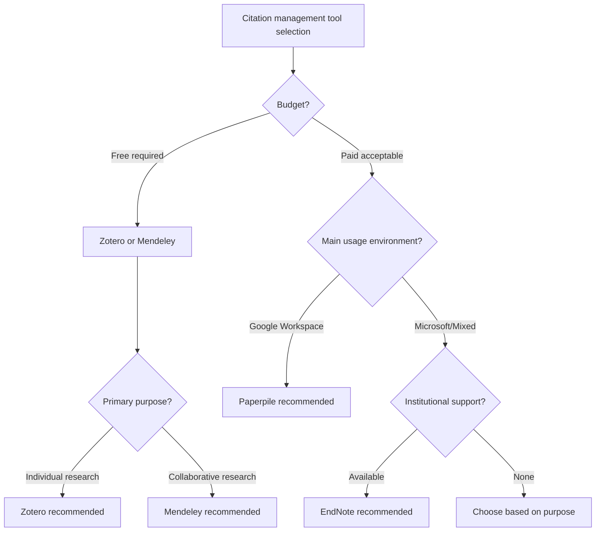
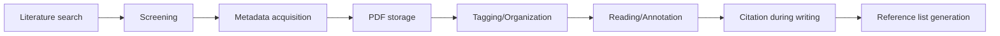

# Citation Management Skills Module

## Overview
This module provides practical skills for citation management using the latest methods from 2024-2025. It adopts a comprehensive approach including latest citation management tools, updated citation style information, efficient literature management methods, and citation ethics in the AI era.

## Citation Management Tool Selection and Utilization

### 1. Major Tool Features and Selection Criteria

#### Zotero (2024-2025 Edition)
```yaml
Features:
  Cost: Completely free
  Storage: 300MB free, additional paid
  
  Strengths:
    - Support for 9,000+ citation styles
    - One-click capture functionality
    - Google Docs/LibreOffice integration
    - Open source
    - ZoteroBib (quick citation generation)
    
  Optimal use cases:
    - Budget-constrained researchers
    - Open source preference
    - Need for diverse citation styles
    - Google Workspace environments
```

#### Mendeley
```yaml
Features:
  Cost: Basic free, institutional version available
  Storage: 2GB free, 100GB institutional
  
  Strengths:
    - Excellent PDF viewer and annotation features
    - Research network functionality
    - Unlimited private groups
    - AI-powered paper recommendations
    
  Optimal use cases:
    - Collaborative research projects
    - PDF-centric workflows
    - Research community building
```

#### EndNote
```yaml
Features:
  Cost: Paid (institutional licenses available)
  Storage: Cloud sync included
  
  Strengths:
    - 6,000+ journal-specific styles
    - Find Full Text feature
    - Tag-based organization system
    - Data recovery functionality
    
  Optimal use cases:
    - Environments with institutional support
    - Large literature collections
    - Publication preparation stage research
```

#### Paperpile
```yaml
Features:
  Cost: Paid (monthly/annual)
  Storage: Cloud-based
  
  Strengths:
    - Seamless Google Docs integration
    - Real-time synchronization
    - Intuitive interface
    - 7,000+ citation styles
    
  Optimal use cases:
    - Google Workspace-centric environments
    - Simplicity preference
    - Multi-device work
```

### 2. Tool Selection Decision Flow



## Reference Library Construction and Management

### 1. Efficient Organization System

#### Folder Structure Design
```yaml
Recommended folder structure:
  By research project:
    - /Project A
      - /Core literature
      - /Related literature
      - /Pending review
    - /Project B
      
  By topic:
    - /Theoretical background
    - /Methodology
    - /Prior research
    - /Latest trends
    
  By status:
    - /Unread
    - /Read
    - /Requires re-reading
    - /To cite
```

#### Tag System Utilization
```yaml
Effective tag strategy:
  Content tags:
    - #core_theory
    - #methodology
    - #case_study
    - #review_article
    
  Quality tags:
    - #high_impact
    - #seminal_work
    - #controversial
    - #outdated
    
  Action tags:
    - #to_cite
    - #to_review
    - #discuss_with_team
    - #verify_data
```

### 2. Metadata Management Best Practices

#### Required Field Verification
- [ ] Author names (complete format)
- [ ] Publication year
- [ ] Title (exact notation)
- [ ] Publication/Conference name
- [ ] Volume, issue, pages
- [ ] DOI/URL
- [ ] Access date (web sources)

#### Metadata Quality Improvement
```yaml
Data cleaning procedures:
  1. Automatic acquisition:
     - Metadata retrieval from DOI
     - Information extraction from PDF
     
  2. Manual verification:
     - Author name standardization (surname order)
     - Special character verification
     - Abbreviation expansion
     
  3. Supplementary information:
     - Abstract/summary
     - Keywords
     - Personal notes
```

## Understanding and Applying Citation Styles

### 1. Major Citation Style Updates (2024-2025)

#### APA 7th Edition Key Changes
```yaml
DOI notation:
  Old: DOI: 10.1234/example
  New: https://doi.org/10.1234/example
  
Author notation:
  - 3+ authors use "et al." from first citation
  - Up to 20 authors listed in reference list
  
AI citation:
  Format: OpenAI. (2023). ChatGPT (Mar 14 version) [Large language model]. 
        https://chat.openai.com/chat
```

#### MLA 9th Edition Features
```yaml
Container concept:
  - Websites, databases, anthologies, etc.
  - Up to 2 containers recordable
  
Digital sources:
  - URLs include "https://"
  - Access date optional
  
AI citation:
  Format: "Your prompt" prompt. ChatGPT, 13 Feb. version, OpenAI, 
        8 Mar. 2023, chat.openai.com/chat.
```

#### IEEE/Chicago/Vancouver Styles
```yaml
IEEE (2024 update):
  - Bracketed number citations [1], [2]
  - DOI required (when available)
  - No hyperlinks
  
Chicago 18th Edition:
  - Choice of footnotes and endnotes
  - DOI recommended
  - Expanded digital source examples
  
Vancouver:
  - Medical field standard
  - Up to 6 authors listed, then et al.
  - NLM format compliance
```

### 2. Citation Style Selection Guide

```yaml
Discipline-specific recommendations:
  STEM:
    - Computer Science: IEEE
    - Engineering: IEEE, ASME
    - Mathematics/Physics: AMS, AIP
    
  Social Sciences:
    - Psychology: APA
    - Sociology: ASA, APA
    - Education: APA
    
  Humanities:
    - Literature: MLA
    - History: Chicago
    - Philosophy: Chicago, MLA
    
  Medicine/Life Sciences:
    - Medicine: Vancouver, AMA
    - Biology: CSE
    - Nursing: APA, AMA
```

## Building Efficient Workflows

### 1. Literature Collection to Citation Flow



### 2. Integrated Workflow Implementation

#### For LaTeX Users
```yaml
Recommended setup:
  1. CiteDrive + Overleaf:
     - Real-time synchronization
     - Automatic BibTeX updates
     - Collaborative editing support
     
  2. Local environment:
     - Zotero + Better BibTeX
     - Git management
     - Automatic export settings
     
  Command examples:
    \cite{smith2024}
    \citep{jones2023}
    \bibliography{references}
```

#### For Word/Google Docs Users
```yaml
Efficient settings:
  Word:
    1. EndNote/Mendeley/Zotero plugins
    2. Pre-configure styles
    3. Enable automatic updates
    
  Google Docs:
    1. Paperpile/Zotero integration
    2. One-click citations
    3. Real-time synchronization
    
  Tips:
    - Utilize Cite While You Write functionality
    - Support drag & drop
    - Bulk style changes
```

## Common Problems and Solutions

### 1. Handling Duplicate Entries

#### Automatic Duplicate Detection
```yaml
Duplicate detection criteria:
  - DOI matching
  - Title similarity
  - Author and year combinations
  
Merge strategy:
  1. Select more complete metadata
  2. Integrate attached files
  3. Combine notes and tags
  4. Delete old entries
```

#### Managing Preprints and Published Versions
```yaml
Best practices:
  - Keep both and link them
  - Tag final version as "primary"
  - Record version history in notes
  - Prioritize published version for citations
```

### 2. Large Library Optimization

#### Performance Improvement Strategies
```yaml
Organization strategy:
  Regular maintenance:
    - Monthly: Check unused entries
    - Quarterly: Bulk metadata updates
    - Annually: Complete library audit
    
  Archival policy:
    - Separate completed projects
    - Manage old literature separately
    - Maintain lightweight working library
```

### 3. Citation Management in Collaborative Research

#### Team Settings
```yaml
Shared library operation:
  Role distribution:
    - Administrator: Style settings, quality management
    - Editor: Entry addition, tagging
    - Viewer: Reference only
    
  Rule establishment:
    - Standardize naming conventions
    - Standardize tags
    - Regular synchronization confirmation
```

## Citation Ethics in the AI Era

### 1. Handling AI-Generated Content

#### When Citation is Required
- AI generates substantial text
- Idea or structure suggestions
- Data analysis or interpretation

#### Citation Format Examples
```yaml
AI citations by style:
  APA:
    OpenAI. (2024). GPT-4 (Version 20240101) [Large language model]. 
    https://openai.com/gpt-4
    
  MLA:
    "Your specific prompt" prompt. GPT-4, 1 Jan. 2024 version, 
    OpenAI, 15 Jan. 2024, chat.openai.com.
    
  Chicago:
    OpenAI. "GPT-4 Response to [Brief Description]." 
    January 15, 2024. https://chat.openai.com.
```

### 2. Promoting Open Citations

#### Open Citation Principles
- Provide in machine-readable format
- Publish under CC0 license
- Store as structured data

## Implementation Checklist

### Initial Setup
- [ ] Select and implement citation management tool
- [ ] Create basic organizational structure
- [ ] Configure citation styles
- [ ] Establish backup methods

### Daily Operations
- [ ] Properly save new literature
- [ ] Verify and correct metadata
- [ ] Organize tags and folders
- [ ] Regular duplicate checking

### During Writing
- [ ] Insert appropriate citations
- [ ] Verify style consistency
- [ ] Generate reference lists
- [ ] Final verification and cleanup

---
**Module Created**: 2025-01-20
**Category**: skills/citation_management
**Version**: 1.0.0