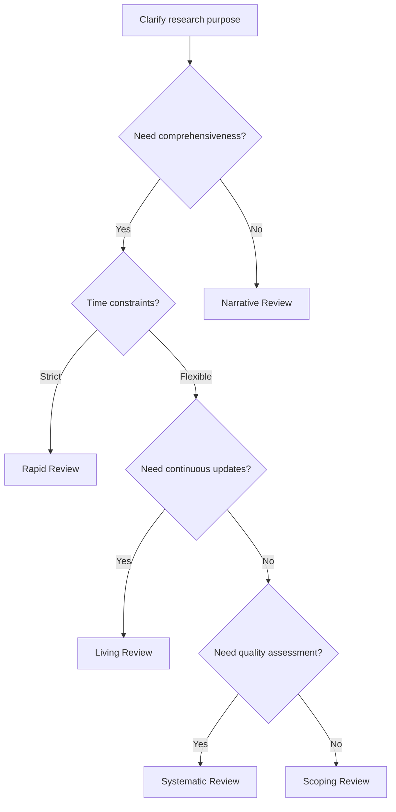

# Literature Review Skills Module

## Overview
This module provides practical skills for conducting literature reviews using the latest methods from 2024-2025. It adopts a comprehensive approach including systematic reviews, scoping reviews, AI-assisted tool utilization, efficient search strategies, and quality assessment methods.

## Types of Literature Reviews and Selection

### 1. Review Type Characteristics and Selection Criteria

#### Systematic Review
```yaml
Characteristics:
  Purpose: Comprehensive evidence synthesis for specific research questions
  Method: Explicit and reproducible protocol
  Duration: Typically 9-12 months
  
Applicable situations:
  - Evaluating intervention effects
  - Verifying diagnostic accuracy
  - Identifying risk factors
  - Evidence for policy decisions
  
PRISMA 2020 compliance requirements:
  - 27-item checklist
  - Flow diagram creation
  - Pre-protocol registration
  - Bias assessment implementation
```

#### Scoping Review
```yaml
Characteristics:
  Purpose: Mapping literature landscape and identifying gaps
  Method: Broad exploratory approach
  Duration: 3-6 months
  
Applicable situations:
  - Overview of emerging fields
  - Identifying research gaps
  - Clarifying concepts
  - Assessing research feasibility
  
JBI methodology compliance:
  - PCC framework (Population, Concept, Context)
  - Clear inclusion/exclusion criteria
  - Data charting
```

#### Rapid Review
```yaml
Characteristics:
  Purpose: Evidence synthesis under time constraints
  Method: Streamlined systematic methods
  Duration: 2-8 weeks
  
Applicable situations:
  - Policy decision support
  - Emergency issue response
  - Preliminary assessment
  - Resource-constrained contexts
  
Cochrane recommended shortcuts:
  - Language restrictions
  - Limited grey literature
  - Single reviewer utilization
  - Simplified quality assessment
```

#### Living Systematic Review
```yaml
Characteristics:
  Purpose: Continuously updated evidence synthesis
  Method: Regular searching and updating
  Duration: Ongoing
  
Applicable situations:
  - Rapidly evolving fields
  - Clinical guidelines
  - Technology assessment
  - Continuous monitoring
  
Technical requirements:
  - Automated search alerts
  - AI-assisted screening
  - Version control
  - Transparent update history
```

### 2. Review Type Selection Flowchart



## Developing Effective Search Strategies

### 1. Database Selection Strategy

#### Core Database Combinations
```yaml
Recommended combinations by field:
  Medicine/Health Sciences:
    Essential: PubMed + Embase + CENTRAL
    Complementary: Web of Science + Google Scholar
    Specialized: PsycINFO (psychiatry), CINAHL (nursing)
    Coverage: ~95%
    
  Social Sciences:
    Essential: Web of Science + Scopus
    Complementary: Google Scholar + JSTOR
    Specialized: PsycINFO, ERIC (education), SocINDEX
    Coverage: ~90%
    
  Engineering/Information Science:
    Essential: IEEE Xplore + ACM Digital Library
    Complementary: Web of Science + arXiv
    Specialized: Engineering Village, CiteSeerX
    Coverage: ~85%
    
  Interdisciplinary Research:
    Essential: Web of Science + Scopus + Google Scholar
    Complementary: Field-specific databases
    Coverage: ~90%
```

#### International Literature Searching
```yaml
Major databases:
  PubMed/MEDLINE:
    - Global biomedical literature
    - Free access
    - MeSH controlled vocabulary
    
  Scopus:
    - Broad disciplinary coverage
    - Citation tracking
    - Author profiles
    
  Web of Science:
    - Core collection
    - Impact metrics
    - Conference proceedings
    
  Google Scholar:
    - Comprehensive coverage
    - Grey literature
    - Version tracking
```

### 2. Search String Construction and Optimization

#### PICO/PCC Framework Utilization
```yaml
PICO (Quantitative research):
  P: Population
  I: Intervention
  C: Comparison
  O: Outcome
  
  Example: 
    P: (diabetes OR "diabetes mellitus")
    I: ("continuous glucose monitoring" OR CGM)
    C: ("self-monitoring" OR SMBG)
    O: ("glycemic control" OR HbA1c)

PCC (Qualitative research):
  P: Population
  C: Concept
  C: Context
  
  Example:
    P: ("healthcare workers" OR nurses OR physicians)
    C: (burnout OR "compassion fatigue")
    C: (pandemic OR COVID-19 OR coronavirus)
```

#### Advanced Search Techniques
```yaml
Effective use of Boolean operators:
  AND: Combining concepts
  OR: Including synonyms/related terms
  NOT: Excluding unwanted results (use cautiously)
  
Proximity operators:
  NEAR/n: Within n words
  ADJ/n: Adjacent with preserved order
  SAME: Within same field
  
Wildcards:
  *: Multiple characters (pediatr* → pediatric, pediatrics)
  ?: Single character (wom?n → woman, women)
  $: Stem searching
  
Field specification:
  [Title]: Title search
  [Title/Abstract]: Title and abstract
  [MeSH]: Medical Subject Headings
  [All Fields]: All fields
```

### 3. AI-Assisted Search Tools

#### Major Tools for 2024-2025
```yaml
AI search assistance:
  Elicit:
    - Natural language questions
    - Automatic paper extraction
    - Summary generation
    
  Semantic Scholar:
    - TLDR summaries
    - Identifying influential citations
    - Related research recommendations
    
  Research Rabbit:
    - Citation network visualization
    - Similar paper discovery
    - Timeline research tracking
    
  Connected Papers:
    - Visual paper mapping
    - Derivative research identification
    - Research lineage understanding
```

## Screening and Selection Process

### 1. Efficient Screening Methods

#### Two-Stage Screening
```yaml
Stage 1 (Title/Abstract):
  Criteria:
    - Clear inclusion/exclusion criteria
    - Include when uncertain
    - Rapid decision-making
    
  Efficiency measures:
    - Batch processing (50-100 items)
    - Keyboard shortcut utilization
    - Regular breaks
    
Stage 2 (Full text):
  Criteria:
    - Detailed eligibility assessment
    - Recording exclusion reasons
    - Concurrent quality assessment
    
  Documentation:
    - PRISMA flow diagram
    - Exclusion reason tallies
    - Disagreement records
```

#### AI-Assisted Screening Tools
```yaml
Rayyan:
  Features:
    - AI relevance scoring
    - 5-star rating system
    - Offline mode support
    - Free version: Up to 3 reviews/month
    
  Utilization:
    - Start with high AI-scored papers
    - Improve accuracy through learning
    - Team blinding
    
Covidence:
  Features:
    - Cochrane-endorsed tool
    - Automatic deduplication
    - Conflict management
    - Quality assessment templates
    
  Utilization:
    - Setup from protocol stage
    - Role-based access management
    - Progress visualization
    
ASReview:
  Features:
    - Active learning
    - Open source
    - Prioritization
    - Inclusion probability estimation
    
  Utilization:
    - Train with initial relevant papers
    - Set stopping criteria
    - Conduct sensitivity analysis
```

### 2. Inter-Reviewer Agreement Management

#### Cohen's Kappa Interpretation
```yaml
Agreement evaluation:
  < 0.00: No agreement
  0.00-0.20: Slight agreement
  0.21-0.40: Fair agreement
  0.41-0.60: Moderate agreement
  0.61-0.80: Substantial agreement
  0.81-1.00: Almost perfect agreement
  
Target values:
  - Screening: κ > 0.60
  - Data extraction: κ > 0.80
  
Improvement strategies:
  - Clarify criteria
  - Pilot testing
  - Regular consultation
```

## Quality Assessment Implementation

### 1. Study Design-Specific Assessment Tools

#### Randomized Controlled Trials (RCTs)
```yaml
Cochrane RoB 2:
  Assessment domains:
    1. Randomization process
    2. Deviations from intended interventions
    3. Missing outcome data
    4. Outcome measurement
    5. Selection of reported results
    
  Judgments:
    - Low risk
    - Some concerns
    - High risk
    
  Outcome-specific assessment:
    - Individual assessment per outcome
    - Overall bias judgment
```

#### Observational Studies
```yaml
ROBINS-I:
  Assessment domains:
    1. Confounding
    2. Selection of participants
    3. Classification of interventions
    4. Deviations from intended interventions
    5. Missing data
    6. Measurement of outcomes
    7. Selection of reported results
    
Newcastle-Ottawa Scale:
  Assessment items:
    - Selection (max 4 stars)
    - Comparability (max 2 stars)
    - Outcome (max 3 stars)
    
  Quality judgment:
    - High quality: 7-9 stars
    - Medium quality: 4-6 stars
    - Low quality: 0-3 stars
```

#### Qualitative Studies
```yaml
CASP Checklist:
  10 questions:
    1. Clear research aims
    2. Appropriate qualitative methodology
    3. Appropriate research design
    4. Appropriate recruitment strategy
    5. Appropriate data collection
    6. Researcher-participant relationship
    7. Ethical considerations
    8. Rigorous data analysis
    9. Clear statement of findings
    10. Research value
    
JBI Critical Appraisal:
  Assessment criteria:
    - Philosophical perspective congruity
    - Methodological congruity
    - Methods congruity
    - Representation congruity
    - Researcher influence
```

### 2. Evidence Certainty Assessment

#### GRADE Approach
```yaml
Initial assessment:
  RCTs: Start with high certainty
  Observational studies: Start with low certainty
  
Downgrading factors:
  1. Risk of bias (-1 or -2)
  2. Inconsistency (-1 or -2)
  3. Indirectness (-1 or -2)
  4. Imprecision (-1 or -2)
  5. Publication bias (-1 or -2)
  
Upgrading factors:
  1. Large effect (+1 or +2)
  2. Dose-response gradient (+1)
  3. Residual confounding (+1)
  
Final judgment:
  - High: True effect lies close to estimate
  - Moderate: True effect likely close to estimate
  - Low: True effect may differ substantially
  - Very low: Estimate very uncertain
```

## Data Extraction and Synthesis

### 1. Structured Data Extraction

#### Extraction Form Design
```yaml
Basic information:
  - Authors, year, country
  - Study design
  - Funding source
  - Conflicts of interest
  
Participant characteristics:
  - Sample size
  - Age, gender
  - Inclusion/exclusion criteria
  - Baseline characteristics
  
Intervention/Exposure:
  - Detailed description
  - Duration, frequency
  - Comparator
  - Adherence
  
Outcomes:
  - Primary/secondary
  - Measurement methods
  - Time points
  - Effect estimates
  
Quality assessment:
  - Tool used
  - Domain assessments
  - Overall assessment
```

#### Data Extraction Standardization
```yaml
Best practices:
  Pilot extraction:
    - Test on 5-10 papers
    - Refine form
    - Clarify definitions
    
  Double extraction:
    - Two independent reviewers
    - Discuss discrepancies
    - Third-party arbitration
    
  Quality control:
    - Regular checks
    - Create extraction guide
    - Document changes
```

### 2. Synthesis Method Selection and Implementation

#### Narrative Synthesis
```yaml
SWiM guideline compliance:
  1. Study grouping
     - By intervention type
     - By outcome
     - By study design
     
  2. Synthesis methods
     - Textual description
     - Tabular summary
     - Effect direction plots
     
  3. Results presentation
     - Pattern identification
     - Heterogeneity exploration
     - Certainty assessment
```

#### Meta-Analysis
```yaml
Implementation conditions:
  - Homogeneous research questions
  - Combinable outcomes
  - Sufficient studies (≥3)
  
Statistical methods:
  Fixed-effect model:
    - Homogeneous studies
    - Small between-study variation
    
  Random-effects model:
    - Heterogeneous studies
    - Emphasis on generalizability
    
Heterogeneity assessment:
  - I² statistic
  - Q test
  - τ² (between-study variance)
  
Sensitivity analysis:
  - Study exclusion impact
  - Model selection impact
  - Outlier impact
```

## Literature Reviews in the AI Era

### 1. Ethical Considerations for AI Use

#### Ensuring Transparency
```yaml
Disclosure items:
  AI tools used:
    - Tool names and versions
    - Purpose and scope
    - Human verification methods
    
  AI roles:
    - Search strategy assistance
    - Screening support
    - Data extraction efficiency
    - Quality checking
    
  Limitations stated:
    - Potential AI errors
    - Bias risks
    - Human final decisions
```

### 2. Future Outlook and Preparation

#### Adapting to New Technologies
```yaml
emerging_technologies:
  Large language models:
    - Natural language searching
    - Automatic summary generation
    - Multilingual support
    
  Automation tools:
    - Continuous review updates
    - Real-time synthesis
    - Predictive analytics
    
Required skills:
  - AI literacy
  - Critical evaluation abilities
  - Adaptive learning
```

## Implementation Checklist

### Protocol Stage
- [ ] Determine review type
- [ ] PROSPERO registration (if applicable)
- [ ] Develop search strategy
- [ ] Clarify selection criteria
- [ ] Select quality assessment tools

### Implementation Stage
- [ ] Comprehensive literature search
- [ ] Deduplication
- [ ] Conduct screening
- [ ] Full-text assessment
- [ ] Data extraction
- [ ] Quality assessment

### Synthesis and Reporting Stage
- [ ] Data synthesis
- [ ] Results interpretation
- [ ] PRISMA-compliant reporting
- [ ] State limitations
- [ ] Practical implications

---
**Module Created**: 2025-01-20
**Category**: skills/literature_review
**Version**: 1.0.0