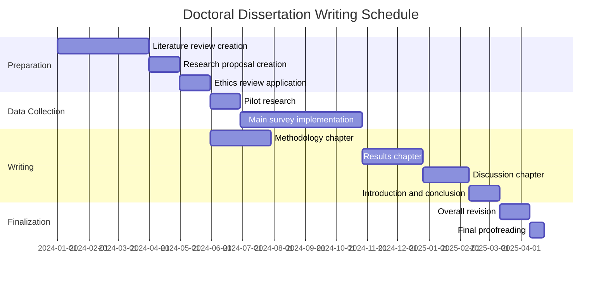

# Thesis Writing Task Module

## Overview
This module provides practical task guidance for writing academic dissertations and research papers using the latest methods from 2024-2025. It adopts a comprehensive approach including thesis structure design, writing process management, digital tool utilization, and quality improvement strategies.

## Thesis Type-Specific Structure Design

### 1. Monograph Format Thesis

#### Basic Structure and Chapter Roles
```yaml
Standard chapter composition:
  Chapter 1 - Introduction:
    Purpose: Research background, problem statement, clear objectives
    Elements:
      - Research motivation and importance
      - Clear presentation of research questions
      - Thesis structure overview
      - Preview of main contributions
    Recommended pages: 15-25 pages
    
  Chapter 2 - Literature Review:
    Purpose: Systematic organization of existing research and gap identification
    Elements:
      - Theoretical background
      - Critical examination of prior research
      - Clear identification of research gaps
      - Presentation of theoretical framework
    Recommended pages: 30-50 pages
    
  Chapter 3 - Research Methodology:
    Purpose: Detailed explanation and justification of research approach
    Elements:
      - Rationale for research design selection
      - Data collection methods
      - Analysis techniques
      - Ethical considerations
      - Research limitations
    Recommended pages: 20-30 pages
    
  Chapters 4-6 - Results and Analysis:
    Purpose: Presentation and detailed analysis of research results
    Elements:
      - Systematic data presentation
      - Key findings
      - Pattern and theme analysis
      - Connection to theory
    Recommended pages: 60-100 pages (total)
    
  Chapter 7 - Discussion:
    Purpose: Result interpretation and theoretical/practical implications
    Elements:
      - Integration of main findings
      - Theoretical contributions
      - Practical implications
      - Research limitations and future directions
    Recommended pages: 25-35 pages
    
  Chapter 8 - Conclusion:
    Purpose: Research summary and clear contribution statement
    Elements:
      - Answers to research questions
      - Summary of main contributions
      - Recommendations for future research
      - Final reflections
    Recommended pages: 10-15 pages
```

#### Discipline-Specific Variations
```yaml
Humanities style:
  Characteristics:
    - Longer theoretical discussions
    - Detailed textual analysis
    - Emphasis on philosophical considerations
  Additional chapters:
    - Theoretical framework (independent chapter)
    - Historical context
    
Social sciences style:
  Characteristics:
    - Balance of empirical and theoretical
    - Mixed methods research
    - Policy recommendation inclusion
  Additional elements:
    - Pilot research
    - Multiple analysis chapters
    
STEM style:
  Characteristics:
    - Short and concise writing
    - Figure/table-centered result presentation
    - Technical details in appendices
  Structural adjustments:
    - Concise literature review
    - Detailed methodology
    - Multiple experimental chapters
```

### 2. Publication-Based Format

#### Components and Integration Methods
```yaml
Basic structure:
  Summary chapter (Kappe):
    Role: Comprehensive document integrating individual papers
    Content:
      - Integrative introduction (15-20 pages)
      - Explanation of research coherence
      - Methodological integration
      - Comprehensive discussion (20-30 pages)
      - Overall conclusion
    
  Paper collection:
    Requirements:
      - 2-5 peer-reviewed papers
      - At least 1 as first author
      - Thematic coherence
      - Published or accepted
    
  Contribution statements:
    Role in each paper:
      - Research design
      - Data collection
      - Analysis implementation
      - Manuscript writing
      - Revision work
```

#### Paper Arrangement Strategy
```yaml
Arrangement options:
  Chronological:
    - Show research development
    - Express methodological evolution
    - Visualize learning process
    
  Thematic:
    - Organize by conceptual relationships
    - From theory to application
    - Build comprehensive understanding
    
  Methodological:
    - From qualitative to quantitative
    - From exploration to verification
    - Gradual complexity increase
```

## Writing Process Management

### 1. Writing Plan Development

#### Reverse Engineering Approach
```yaml
Countdown from deadline:
  Submission - 2 weeks: Final proofreading
  Submission - 1 month: Final draft completion
  Submission - 2 months: All chapter first drafts completed
  Submission - 3 months: Analysis and discussion writing
  Submission - 6 months: Data collection completion
  Submission - 9 months: Methodology finalization
  Submission - 12 months: Literature review completion
```

#### Chapter-Specific Writing Schedule
```yaml
Efficient writing order:
  1. Methodology chapter:
     - Write during research implementation
     - Base on detailed records
     - Early completion possible
     
  2. Results chapter:
     - Parallel with data analysis
     - Prioritize figure/table creation
     - Add descriptions later
     
  3. Literature review:
     - Continuous updates
     - Revise from initial draft
     - Add latest literature
     
  4. Introduction and conclusion:
     - Write after other chapters completed
     - Based on overall picture
     - Ensure consistency
```

### 2. Daily Writing Habits

#### Pomodoro Technique Application
```yaml
Thesis writing customization:
  Morning session (creative work):
    - 25 min: New writing
    - 5 min: Break
    - 25 min: New writing
    - 5 min: Break
    - 25 min: Structure review
    - 15 min: Long break
    
  Afternoon session (editing work):
    - 25 min: Text revision
    - 5 min: Break
    - 25 min: Citation checking
    - 5 min: Break
    - 25 min: Figure/table adjustment
    - 15 min: Long break
    
  Weekly goals:
    - Mon-Wed: New writing (1500-2000 words/day)
    - Thu-Fri: Revision and editing
    - Weekend: Literature organization and planning
```

#### Writing Environment Optimization
```yaml
Physical environment:
  Essential elements:
    - Quiet space
    - Adequate lighting
    - Ergonomic chair
    - Large monitor (preferably dual screen)
    
Digital environment:
  Productivity tools:
    - Focusmate (virtual coworking)
    - Forest (focus app)
    - RescueTime (time tracking)
    - Cold Turkey (website blocking)
```

### 3. Progress Management System

#### Gantt Chart Utilization


#### Milestone Setting
```yaml
Major milestones:
  3 months:
    - Literature review first draft completed
    - Research methodology finalized
    - □ Supervisor approval obtained
    
  6 months:
    - Data collection 50% completed
    - Methodology chapter completed
    - □ Mid-term presentation prepared
    
  9 months:
    - All data collection completed
    - Analysis initiated
    - □ Conference presentation applied
    
  12 months:
    - All chapter first drafts completed
    - □ Internal review conducted
```

## Effective Digital Tool Utilization

### 1. Writing Tool Selection and Setup

#### LaTeX Environment Construction
```yaml
Recommended setup:
  Editors:
    - Overleaf (cloud-based)
      - Real-time collaborative editing
      - Version history
      - Rich templates
    - TeXstudio (local)
      - Advanced customization
      - Offline work
      - Integrated environment
      
  Packages:
    Essential:
      - babel (multilingual)
      - graphicx (figures/tables)
      - hyperref (hyperlinks)
      - biblatex (references)
    Recommended:
      - glossaries (glossary)
      - listings (source code)
      - algorithm2e (algorithms)
      
  Templates:
    - University-provided templates
    - thesis.cls customization
    - Chapter-based file management
```

#### Word Environment Optimization
```yaml
Efficiency settings:
  Style utilization:
    - Heading style settings
    - Body text style unification
    - Citation style definition
    - Figure/table captions
    
  Automation features:
    - Automatic table of contents generation
    - Cross-reference settings
    - Automatic figure/table numbering
    - Index creation
    
  Add-ins:
    - Mendeley/Zotero
    - Grammarly
    - MathType
    - Draw.io
```

### 2. Version Control and Backup

#### Git/GitHub Workflow
```yaml
Branch strategy:
  main:
    - Stable versions only
    - Version management with tags
    
  develop:
    - Daily work
    - Regular merging to main
    
  chapter/[name]:
    - Chapter-specific branches
    - Integrate to develop when complete
    
  revision/[date]:
    - For major revisions
    - Merge after review

Commit conventions:
  Format: [type]: [chapter] brief description
  Examples:
    - feat: methodology added data analysis section
    - fix: results corrected figure 3.2
    - docs: literature updated recent studies
```

#### Automated Backup System
```yaml
3-2-1 rule:
  3 copies:
    1. Working (local)
    2. Sync (cloud)
    3. Archive (external)
    
  2 different media:
    - Cloud storage
    - Physical media (HDD/SSD)
    
  1 offsite:
    - University server
    - Or different location
    
Automation tools:
  - Time Machine (Mac)
  - File History (Windows)
  - rsync (Linux)
  - Dropbox/Google Drive
```

### 3. AI Writing Support Tool Utilization

#### Appropriate Use Cases
```yaml
Recommended uses:
  Text improvement:
    - Grammar checking
    - Clarity enhancement
    - Rephrasing suggestions
    Example: "Make this sentence more academic"
    
  Structural support:
    - Outline generation
    - Paragraph structure suggestions
    - Transition sentence creation
    Example: "Organize these points into 3 categories"
    
  Idea development:
    - Brainstorming
    - Related concept exploration
    - Counterargument anticipation
    Example: "List criticisms of this theory"
```

#### Ethical Use Guidelines
```yaml
Required disclosures:
  Usage scope:
    - Which tools were used
    - Which parts they were used for
    - Level of dependence
    
  Disclosure example:
    "In writing this thesis, Grammarly and
    ChatGPT were used for grammar checking and
    improving text clarity. All content was
    created by the author, and AI was used
    only for editing assistance."
    
Prohibited activities:
  - Requesting substantial content generation
  - Delegating data analysis
  - Outsourcing theory construction
  - Creating fabricated citations
```

## Quality Improvement Strategies

### 1. Self-Review System

#### Staged Review Process
```yaml
Stage 1 - Structural review (1 week later):
  Checklist:
    □ Confirm logical flow
    □ Clarify each chapter's role
    □ Check for overlaps/gaps
    □ Assess overall balance
    
Stage 2 - Content review (2 weeks later):
  Checklist:
    □ Argument consistency
    □ Evidence sufficiency
    □ Analysis depth
    □ Conclusion validity
    
Stage 3 - Language review (3 weeks later):
  Checklist:
    □ Grammar and spelling
    □ Academic tone
    □ Terminology consistency
    □ Citation format
```

#### Review Checklist
```yaml
Overall structure:
  □ Are research questions clear?
  □ Does each chapter contribute to research questions?
  □ Is the argument flow logical?
  □ Are conclusions based on evidence?
  
Academic rigor:
  □ Is prior research comprehensive?
  □ Is methodology appropriate?
  □ Is analysis systematic?
  □ Are limitations recognized?
  
Expression and format:
  □ Is writing clear and concise?
  □ Are technical terms defined?
  □ Are figures/tables effective?
  □ Are citations accurate?
  
Originality:
  □ Are there new insights?
  □ Are theoretical contributions clear?
  □ Are practical implications specific?
  □ Are future research directions provided?
```

### 2. Peer Review Utilization

#### Writing Group Formation
```yaml
Ideal composition:
  Size: 3-5 members
  Frequency: Biweekly meetings
  Duration: 2-3 hours/session
  
Member composition:
  - Writers at similar stage
  - Different field perspectives
  - Mutual support spirit
  
Activities:
  1. Progress reports (15 min/person)
  2. Pre-submitted manuscript discussion
  3. Specific improvement suggestions
  4. Next session goal setting
```

#### Effective Feedback
```yaml
Constructive feedback principles:
  Sandwich method:
    1. Point out positives
    2. Improvement suggestions
    3. Close with encouragement
    
  Specificity:
    × "This part is unclear"
    ○ "In p.23, paragraph 2, clarifying
       the relationship between A and B
       would strengthen the argument"
    
  Actionability:
    - Present specific revision proposals
    - Recommend references
    - Suggest alternative structures
```

### 3. Expert Review Preparation

#### Preparation for Supervisor Submission
```yaml
Submission package:
  Required documents:
    - Completed chapter manuscript
    - Chapter summary (1-2 pages)
    - Main argument list
    - Questions for discussion
    
  Additional materials:
    - Related figures/tables
    - Reference list
    - Revision history
    
  Submission timing:
    - Within 1 week of chapter completion
    - 1 week before meeting
    - Regular schedule
```

## Common Challenge Solutions

### 1. Overcoming Writer's Block

#### Cognitive Approaches
```yaml
Block type-specific strategies:
  Perfectionism type:
    - Allow "ugly first drafts"
    - Timed free writing
    - No-editing rules
    
  Unclear structure type:
    - Create mind maps
    - Voice recording explanations
    - Structure with sticky notes
    
  Lost motivation type:
    - Set small achievement goals
    - Reward systems
    - Share with peers
```

#### Practical Techniques
```yaml
Immediate effectiveness methods:
  Change location:
    - Café
    - Library
    - Coworking space
    
  Change format:
    - Hand-written drafts
    - Voice input
    - Start with diagrams
    
  Change timing:
    - Early morning writing
    - Short bursts
    - Pomodoro technique
```

### 2. Time Management Optimization

#### Priority Matrix
```yaml
Urgency × Importance:
  Quadrant 1 (Urgent and Important):
    - Chapters near deadline
    - Supervisor submissions
    - Data analysis completion
    → Execute immediately
    
  Quadrant 2 (Important but Not Urgent):
    - Continuous literature updates
    - Methodology refinement
    - Theoretical framework development
    → Execute systematically
    
  Quadrant 3 (Urgent but Not Important):
    - Detailed formatting adjustments
    - Perfect text polishing
    - Additional analysis
    → Delegate or postpone
    
  Quadrant 4 (Neither Urgent nor Important):
    - Excessive literature collection
    - Irrelevant discussions
    - Decorative elements
    → Eliminate or minimize
```

### 3. Motivation Maintenance

#### Long-term Motivation Strategies
```yaml
Intrinsic motivation strengthening:
  Meaning reconfirmation:
    - Social significance of research
    - Personal growth
    - Intellectual curiosity
    
  Autonomy assurance:
    - Self-determination opportunities
    - Method choices
    - Pace adjustment
    
  Achievement creation:
    - Small goal setting
    - Progress visualization
    - Result sharing
```

#### Support System Construction
```yaml
Multi-layered support structure:
  Academic support:
    - Supervisor
    - Co-supervisor
    - Research peers
    
  Emotional support:
    - Family and friends
    - Counseling
    - Peer support
    
  Practical support:
    - Administrative staff
    - Librarians
    - IT support
```

## Final Stage Checklist

### Pre-Submission Comprehensive Check
```yaml
Content:
  □ Clear answers to research questions
  □ Logical consistency assurance
  □ Sufficient evidence presentation
  □ Appropriate limitation recognition
  □ Clear contribution description
  
Format:
  □ Specified format compliance
  □ Page requirement fulfillment
  □ Citation format consistency
  □ Figure/table number verification
  □ Reference completeness
  
Technical:
  □ Spell check completed
  □ Grammar verified
  □ PDF generation normal
  □ Link functionality confirmed
  □ Appropriate file naming
  
Administrative:
  □ Required document preparation
  □ Submission deadline confirmation
  □ Backup creation
  □ Print version preparation
  □ Electronic version optimization
```

---
**Module Created**: 2025-01-20
**Category**: tasks/thesis_writing
**Version**: 1.0.0