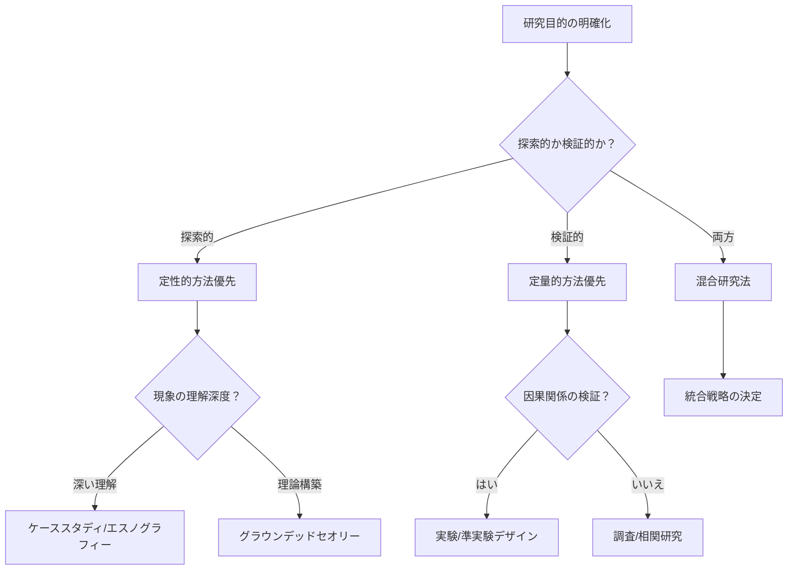

# 研究方法論モジュール

## 概要
このモジュールは、2024-2025年の最新の研究方法論に関する体系的知識を提供します。研究デザインの選択、データ収集方法、分析技術、AI統合、倫理的配慮を含む包括的なアプローチを採用しています。

## 研究デザインアプローチ

### 1. 定量的研究方法

#### 実験研究デザイン
```yaml
実験デザインの種類:
  真実験デザイン:
    特徴:
      - ランダム割り当て
      - 統制群の設置
      - 操作変数の制御
    適用場面:
      - 因果関係の検証
      - 介入効果の測定
      - 仮説検定
    
  準実験デザイン:
    特徴:
      - ランダム割り当てなし
      - 既存グループの活用
      - 統計的制御
    適用場面:
      - 教育研究
      - 政策評価
      - 自然実験
    
  前実験デザイン:
    特徴:
      - 最小限の制御
      - 探索的性質
      - パイロット研究
    適用場面:
      - 初期調査
      - 実現可能性検討
      - 予備的知見
```

#### 調査研究
```yaml
調査デザインの選択:
  横断的調査:
    - 一時点でのデータ収集
    - 大規模サンプル可能
    - 因果推論に限界
    
  縦断的調査:
    パネル調査:
      - 同一対象の追跡
      - 変化の測定
      - 脱落バイアスに注意
    
    コホート調査:
      - 特定集団の追跡
      - 世代効果の分析
      - 長期的視点
    
    トレンド調査:
      - 異なるサンプル
      - 時系列変化
      - 社会変動の把握
```

#### 相関研究とビッグデータ分析
```yaml
現代的アプローチ:
  機械学習統合:
    - 予測モデリング
    - パターン認識
    - 異常検出
    - 特徴量エンジニアリング
    
  ビッグデータ分析:
    - リアルタイムデータ
    - 非構造化データ
    - ソーシャルメディア分析
    - センサーデータ活用
    
  因果推論手法:
    - 傾向スコアマッチング
    - 操作変数法
    - 回帰不連続デザイン
    - 差分の差分法
```

### 2. 定性的研究方法

#### ケーススタディ
```yaml
ケーススタディの類型:
  単一ケース:
    内在的ケース:
      - ケース自体への関心
      - 深い理解の追求
      - 独自性の探求
    
    道具的ケース:
      - 理論検証の手段
      - 一般的問題の例示
      - 概念の明確化
    
  複数ケース:
    比較ケース:
      - 類似点と相違点
      - パターンの発見
      - 理論の精緻化
    
    集合的ケース:
      - 現象の多面的理解
      - 文脈の多様性
      - 一般化の可能性
```

#### エスノグラフィー
```yaml
現代的エスノグラフィー:
  デジタルエスノグラフィー:
    - オンラインコミュニティ
    - バーチャル参与観察
    - デジタルアーティファクト
    - ソーシャルメディア分析
    
  マルチサイトエスノグラフィー:
    - 複数フィールドの連結
    - グローバルな視点
    - 移動と流動性
    - トランスナショナル研究
    
  自己エスノグラフィー:
    - 研究者の経験活用
    - 反省的アプローチ
    - 文化的自己の探求
    - ナラティブ手法
```

#### グラウンデッドセオリー
```yaml
グラウンデッドセオリーのバリエーション:
  古典的GT (Glaser):
    - 創発的アプローチ
    - 理論的感受性
    - 継続的比較法
    - 理論的飽和
    
  構成主義的GT (Charmaz):
    - 研究者の役割承認
    - 相互作用の重視
    - 柔軟なコーディング
    - 解釈的理解
    
  体系的GT (Strauss & Corbin):
    - 構造化された手順
    - 軸足コーディング
    - 条件マトリックス
    - パラダイムモデル
```

### 3. 混合研究法

#### 混合研究法デザイン
```yaml
基本的デザイン:
  収束的平行デザイン:
    手順:
      1. 定量・定性データ同時収集
      2. 独立した分析
      3. 結果の統合と比較
      4. 統合的解釈
    利点:
      - 三角測量による妥当性
      - 包括的理解
      - 効率的なデータ収集
      
  説明的順次デザイン:
    手順:
      1. 定量データ収集・分析
      2. 結果に基づく定性調査設計
      3. 定性データで説明・深化
      4. 統合的考察
    利点:
      - 予期せぬ結果の探求
      - メカニズムの解明
      - 文脈的理解
      
  探索的順次デザイン:
    手順:
      1. 定性的探索
      2. 仮説・尺度開発
      3. 定量的検証
      4. モデル構築
    利点:
      - 新概念の開発
      - 尺度の妥当性
      - 理論構築
```

#### 統合戦略
```yaml
データ統合の方法:
  変換的統合:
    - 定性データの数量化
    - 定量データの質的解釈
    - 共通メトリックスの作成
    
  ジョイントディスプレイ:
    - 視覚的統合
    - マトリックス表示
    - 並列比較
    - メタ推論
    
  ナラティブ統合:
    - ストーリーテリング
    - 事例の織り込み
    - テーマ的統合
    - 理論的説明
```

## データ収集方法

### 1. サンプリング戦略

#### 確率サンプリング
```yaml
確率サンプリング手法:
  単純無作為抽出:
    手順:
      - 母集団リスト作成
      - 乱数生成
      - サンプル選択
    ツール:
      - R: sample()
      - Python: random.sample()
      - SPSS: Random sample
      
  層化抽出:
    考慮事項:
      - 層の定義
      - 比例配分vs最適配分
      - 層内の均質性
    計算:
      - Neyman配分
      - 最小分散推定
      
  クラスター抽出:
    段階:
      - 第一次抽出単位
      - 第二次抽出単位
      - デザイン効果の考慮
    効率性:
      - コスト削減
      - 精度の低下
      - トレードオフ
```

#### 非確率サンプリング
```yaml
目的的サンプリング:
  最大多様性:
    - 現象の幅を捉える
    - 共通パターンの発見
    - 包括的理解
    
  極端事例:
    - 例外的ケース
    - 境界条件の探求
    - 理論の限界
    
  理論的サンプリング:
    - 理論構築志向
    - 継続的選択
    - 飽和まで継続
    
  スノーボール:
    - ハードtoリーチ集団
    - ネットワーク活用
    - 信頼関係構築
```

### 2. データ収集ツールと技術

#### デジタル時代の調査ツール
```yaml
オンライン調査プラットフォーム:
  Qualtrics:
    機能:
      - 高度な分岐ロジック
      - リアルタイム分析
      - API統合
      - 多言語対応
    
  Google Forms + AI:
    拡張機能:
      - 自動質問生成
      - 感情分析
      - 回答品質チェック
      - 適応的質問
    
  専門調査ツール:
    REDCap:
      - 医療研究特化
      - HIPAA準拠
      - 監査証跡
    
    SurveyMonkey Enterprise:
      - 企業調査
      - ベンチマーク
      - 統合分析
```

#### インタビューと観察の革新
```yaml
バーチャルインタビュー:
  ツールと技術:
    Zoom/Teams:
      - 録画・文字起こし
      - 画面共有
      - ブレイクアウトルーム
      
    専門ツール:
      - Otter.ai: AI文字起こし
      - MAXQDA: リアルタイム分析
      - Dedoose: クラウド協働
      
  品質確保:
    - 技術的準備
    - ラポール構築
    - 非言語的手がかり
    - データセキュリティ
```

#### IoTとウェアラブルデバイス
```yaml
生体データ収集:
  デバイス:
    - Fitbit/Apple Watch
    - 心拍変動モニター
    - 睡眠トラッカー
    - 環境センサー
    
  統合プラットフォーム:
    - Apple HealthKit
    - Google Fit API
    - Open mHealth
    
  倫理的配慮:
    - 継続的同意
    - データ最小化
    - 参加者の負担
    - プライバシー保護
```

### 3. データ品質管理

#### 妥当性と信頼性
```yaml
妥当性の確保:
  内容妥当性:
    - 専門家レビュー
    - 認知インタビュー
    - パイロットテスト
    
  構成概念妥当性:
    - 因子分析
    - 収束・弁別妥当性
    - 多特性多方法行列
    
  基準関連妥当性:
    - 同時的妥当性
    - 予測的妥当性
    - 既知集団法
    
信頼性の評価:
  内的整合性:
    - Cronbach's α
    - McDonald's ω
    - 複合信頼性
    
  テスト-再テスト:
    - 級内相関係数
    - Bland-Altman plot
    - 一致度分析
    
  評価者間信頼性:
    - Cohen's κ
    - Fleiss' κ
    - ICC
```

## データ分析技術

### 1. 高度な統計分析

#### AI強化統計分析
```yaml
自動化された分析:
  仮定チェック:
    - 正規性の自動検定
    - 外れ値の検出
    - 多重共線性診断
    - 推奨変換
    
  モデル選択:
    - AutoML統合
    - ベイズモデル平均
    - 交差検証
    - 情報量基準
    
  解釈支援:
    - 効果量の計算
    - 可視化推奨
    - 平易な言語での説明
    - 実践的含意
```

#### 因果推論の新手法
```yaml
現代的因果推論:
  DAG (有向非巡回グラフ):
    - 因果構造の明示化
    - 交絡の特定
    - 媒介分析
    - バックドア基準
    
  機械学習因果推論:
    - Causal Forest
    - Double ML
    - Targeted Learning
    - Uplift Modeling
    
  感度分析:
    - 未測定交絡
    - Rosenbaum bounds
    - E-value
    - Tipping point分析
```

### 2. 定性的データ分析

#### AI支援定性分析
```yaml
NLP統合分析:
  自動コーディング:
    - 初期コード生成
    - テーマ抽出
    - 感情分析
    - エンティティ認識
    
  パターン認識:
    - 潜在的テーマ
    - 概念間関係
    - 時系列パターン
    - 異常検出
    
  多言語対応:
    - 自動翻訳統合
    - 文化的ニュアンス
    - バックトランスレーション
    - 言語間比較
```

#### CAQDAS最新動向
```yaml
主要ソフトウェア2024-2025:
  NVivo:
    新機能:
      - AI駆動の自動コーディング
      - リアルタイム共同作業
      - 統合文献レビュー
      - 感情・感性分析
      
  ATLAS.ti:
    クラウド版:
      - どこでもアクセス
      - チーム分析
      - API統合
      - 機械学習連携
      
  MAXQDA:
    統合分析:
      - 混合研究法対応
      - 統計パッケージ連携
      - ビジュアル分析
      - AI転写サービス
```

### 3. ビッグデータと予測分析

#### 大規模データ処理
```yaml
分散処理フレームワーク:
  Apache Spark:
    - MLlib統合
    - リアルタイム処理
    - スケーラブル
    
  クラウドプラットフォーム:
    AWS:
      - SageMaker
      - EMR
      - Athena
      
    Google Cloud:
      - BigQuery ML
      - Dataflow
      - AutoML
      
    Azure:
      - Machine Learning
      - Databricks
      - Synapse Analytics
```

## 研究倫理とコンプライアンス

### 1. IRB/倫理審査の最新動向

#### AI研究の倫理ガイドライン
```yaml
AI特有の倫理配慮:
  アルゴリズムの透明性:
    - モデルの説明可能性
    - 決定プロセスの開示
    - ブラックボックス問題
    - 監査可能性
    
  バイアスと公平性:
    - データセットの偏り
    - アルゴリズムバイアス
    - 公平性メトリクス
    - 影響評価
    
  自律性と制御:
    - 人間の監督
    - オプトアウト権
    - 説明を受ける権利
    - 異議申し立て
```

#### デジタル時代の同意
```yaml
動的同意モデル:
  段階的同意:
    - 初期同意
    - 追加用途の同意
    - 撤回メカニズム
    - 同意管理システム
    
  電子同意:
    - デジタル署名
    - 理解度確認
    - 多言語対応
    - アクセシビリティ
    
  継続的同意:
    - 定期的な確認
    - 用途変更の通知
    - 透明性レポート
    - 参加者ダッシュボード
```

### 2. データプライバシーとセキュリティ

#### 最新規制への対応
```yaml
グローバル規制:
  GDPR (EU):
    - データ最小化
    - 目的制限
    - 忘れられる権利
    - データポータビリティ
    
  AI Act (EU):
    - リスクベースアプローチ
    - 高リスクAIの要件
    - 適合性評価
    - 市場監視
    
  各国規制:
    日本:
      - 個人情報保護法
      - 次世代医療基盤法
      - AI倫理ガイドライン
      
    米国:
      - HIPAA (医療)
      - FERPA (教育)
      - 州別プライバシー法
```

#### 技術的保護措置
```yaml
プライバシー強化技術:
  差分プライバシー:
    - ノイズ追加
    - プライバシー予算
    - 有用性とのバランス
    
  連合学習:
    - 分散モデル訓練
    - データ非移動
    - プライバシー保護
    
  準同型暗号:
    - 暗号化データ分析
    - 計算オーバーヘッド
    - 実用的応用
    
  セキュアマルチパーティ計算:
    - 共同分析
    - データ秘匿
    - プロトコル設計
```

### 3. オープンサイエンスと研究誠実性

#### オープンデータ実践
```yaml
FAIR原則の実装:
  Findable (発見可能):
    - 永続識別子
    - メタデータ
    - インデックス化
    - 検索可能性
    
  Accessible (アクセス可能):
    - 標準プロトコル
    - 認証・認可
    - メタデータ永続性
    - ライセンス明記
    
  Interoperable (相互運用可能):
    - 標準フォーマット
    - 統制語彙
    - API提供
    - クロスリファレンス
    
  Reusable (再利用可能):
    - 明確なライセンス
    - 詳細な文書化
    - データ来歴
    - 品質保証
```

#### 研究の再現性
```yaml
再現性の要素:
  計算的再現性:
    - コード公開
    - 環境設定
    - バージョン管理
    - コンテナ化
    
  実証的再現性:
    - プロトコル共有
    - 生データ提供
    - 分析スクリプト
    - 詳細な方法記述
    
  概念的再現性:
    - 理論的根拠
    - 操作的定義
    - 測定手順
    - 解釈の透明性
```

## 実装ガイドライン

### 1. 研究計画の策定

#### 研究デザインの選択フロー


### 2. 品質保証チェックリスト

#### 研究の各段階での確認事項
```yaml
計画段階:
  □ 研究目的と方法の整合性
  □ 倫理審査申請の準備
  □ サンプルサイズの根拠
  □ データ管理計画
  □ リスク評価と対策
  
実施段階:
  □ プロトコルの遵守
  □ データ品質チェック
  □ 参加者の安全確保
  □ 進捗モニタリング
  □ 問題発生時の対応
  
分析段階:
  □ 分析計画の実行
  □ 仮定の確認
  □ 感度分析の実施
  □ 結果の妥当性検証
  □ 解釈の適切性
  
報告段階:
  □ 透明性の確保
  □ 限界の明記
  □ 利益相反の開示
  □ データ共有準備
  □ 報告ガイドライン準拠
```

### 3. ツールとリソース

#### 推奨ツールエコシステム
```yaml
研究段階別ツール:
  文献管理:
    - Zotero/Mendeley
    - Rayyan (スクリーニング)
    - VOSviewer (ビブリオメトリクス)
    
  プロジェクト管理:
    - Open Science Framework
    - GitHub/GitLab
    - Trello/Asana
    
  データ収集:
    - REDCap
    - Qualtrics
    - KoBoToolbox
    
  データ分析:
    定量: R/Python/SPSS/SAS
    定性: NVivo/ATLAS.ti/MAXQDA
    混合: Dedoose/QDA Miner
    
  共有・公開:
    - Zenodo/Figshare
    - OSF Preprints
    - Protocols.io
```

---
**モジュール作成日**: 2025-01-20
**カテゴリ**: methods/research_methodology
**バージョン**: 1.0.0