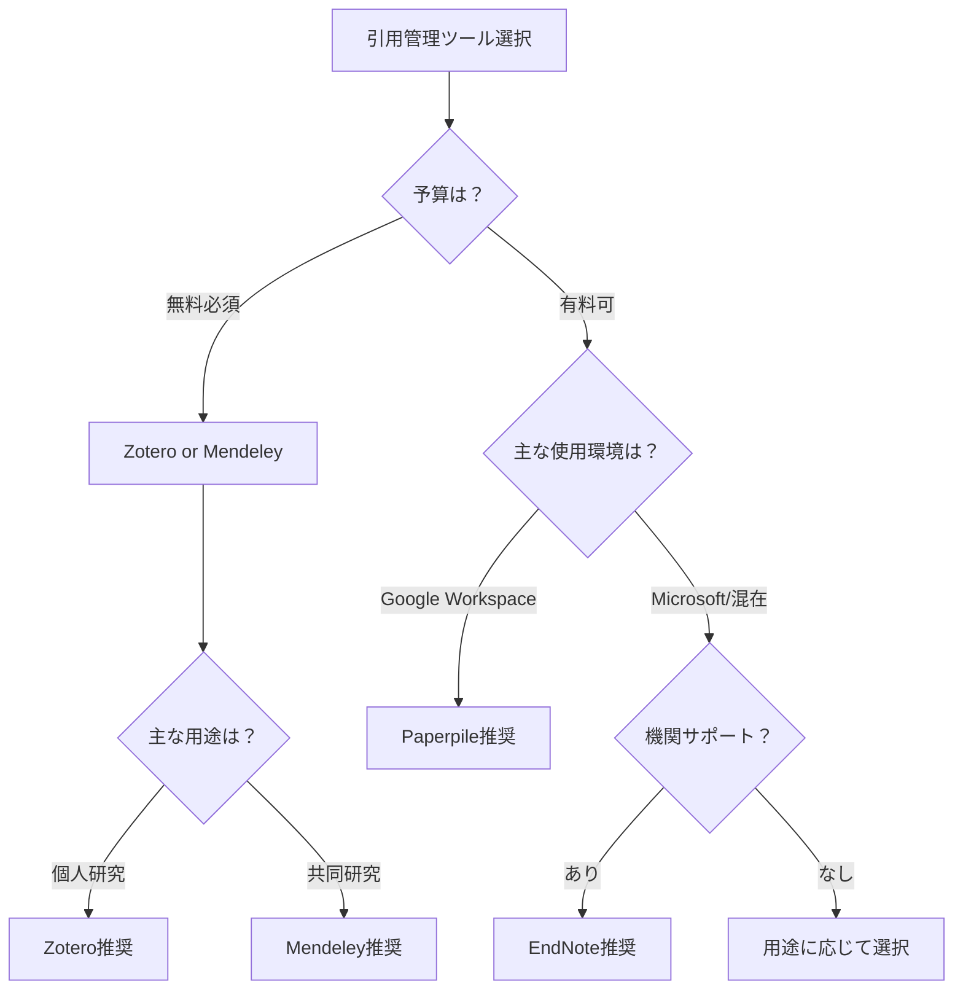

# 引用管理スキルモジュール

## 概要
このモジュールは、2024-2025年の最新の引用管理に関する実践的スキルを提供します。最新の引用管理ツール、引用スタイルの更新情報、効率的な文献管理方法、AI時代の引用倫理を含む包括的なアプローチを採用しています。

## 引用管理ツールの選択と活用

### 1. 主要ツールの特徴と選択基準

#### Zotero（2024-2025版）
```yaml
特徴:
  コスト: 完全無料
  ストレージ: 300MB無料、追加は有料
  
  強み:
    - 9,000以上の引用スタイル対応
    - ワンクリックキャプチャ機能
    - Google Docs/LibreOffice統合
    - オープンソース
    - ZoteroBib（クイック引用生成）
    
  最適な使用場面:
    - 予算が限られている研究者
    - オープンソースを重視
    - 多様な引用スタイルが必要
    - Google Workspace環境
```

#### Mendeley
```yaml
特徴:
  コスト: 基本無料、機関版あり
  ストレージ: 2GB無料、機関版100GB
  
  強み:
    - 優れたPDFビューアと注釈機能
    - 研究者ネットワーク機能
    - 無制限のプライベートグループ
    - AIによる論文推薦
    
  最適な使用場面:
    - 共同研究プロジェクト
    - PDF中心の文献管理
    - 研究コミュニティ構築
```

#### EndNote
```yaml
特徴:
  コスト: 有料（機関ライセンスあり）
  ストレージ: クラウド同期付き
  
  強み:
    - 6,000以上のジャーナル固有スタイル
    - Find Full Text機能
    - タグベースの整理システム
    - データ復元機能
    
  最適な使用場面:
    - 機関サポートがある環境
    - 大規模な文献コレクション
    - 出版準備段階の研究
```

#### Paperpile
```yaml
特徴:
  コスト: 有料（月額/年額）
  ストレージ: クラウドベース
  
  強み:
    - シームレスなGoogle Docs統合
    - リアルタイム同期
    - 直感的なインターフェース
    - 7,000以上の引用スタイル
    
  最適な使用場面:
    - Google Workspace中心の環境
    - シンプルさを重視
    - 複数デバイスでの作業
```

### 2. ツール選択の意思決定フロー



## 参考文献ライブラリの構築と管理

### 1. 効率的な整理システム

#### フォルダ構造の設計
```yaml
推奨フォルダ構造:
  研究プロジェクト別:
    - /プロジェクトA
      - /主要文献
      - /関連文献
      - /レビュー待ち
    - /プロジェクトB
      
  トピック別:
    - /理論的背景
    - /方法論
    - /先行研究
    - /最新動向
    
  ステータス別:
    - /未読
    - /読了
    - /要再読
    - /引用予定
```

#### タグシステムの活用
```yaml
効果的なタグ戦略:
  内容タグ:
    - #core_theory
    - #methodology
    - #case_study
    - #review_article
    
  品質タグ:
    - #high_impact
    - #seminal_work
    - #controversial
    - #outdated
    
  アクションタグ:
    - #to_cite
    - #to_review
    - #discuss_with_team
    - #verify_data
```

### 2. メタデータ管理のベストプラクティス

#### 必須フィールドの確認
- [ ] 著者名（完全な形式）
- [ ] 出版年
- [ ] タイトル（正確な表記）
- [ ] 出版物名/会議名
- [ ] 巻・号・ページ
- [ ] DOI/URL
- [ ] アクセス日（ウェブソース）

#### メタデータの品質向上
```yaml
データクリーニング手順:
  1. 自動取得:
     - DOIからのメタデータ取得
     - PDFからの情報抽出
     
  2. 手動確認:
     - 著者名の統一（姓名順序）
     - 特殊文字の確認
     - 略語の展開
     
  3. 補完情報:
     - 要約/アブストラクト
     - キーワード
     - 個人的メモ
```

## 引用スタイルの理解と適用

### 1. 主要引用スタイルの更新情報（2024-2025）

#### APA第7版の主要変更点
```yaml
DOI表記:
  旧: DOI: 10.1234/example
  新: https://doi.org/10.1234/example
  
著者表記:
  - 3人以上は初回から"et al."
  - 最大20人まで参考文献リストに記載
  
AI引用:
  形式: OpenAI. (2023). ChatGPT (Mar 14 version) [Large language model]. 
        https://chat.openai.com/chat
```

#### MLA第9版の特徴
```yaml
コンテナ概念:
  - ウェブサイト、データベース、アンソロジーなど
  - 2つのコンテナまで記載可能
  
デジタルソース:
  - URLは"https://"を含める
  - アクセス日は任意
  
AI引用:
  形式: "Your prompt" prompt. ChatGPT, 13 Feb. version, OpenAI, 
        8 Mar. 2023, chat.openai.com/chat.
```

#### IEEE/Chicago/Vancouverスタイル
```yaml
IEEE（2024更新）:
  - 角括弧の数字引用 [1], [2]
  - DOI必須（利用可能な場合）
  - ハイパーリンクなし
  
Chicago第18版:
  - 脚注と文末注の選択
  - DOI推奨
  - デジタルソースの拡張例
  
Vancouver:
  - 医学系標準
  - 著者6人まで記載、以降et al.
  - NLM形式準拠
```

### 2. 引用スタイル選択ガイド

```yaml
分野別推奨:
  理工系:
    - コンピュータサイエンス: IEEE
    - 工学: IEEE, ASME
    - 数学/物理: AMS, AIP
    
  社会科学:
    - 心理学: APA
    - 社会学: ASA, APA
    - 教育学: APA
    
  人文科学:
    - 文学: MLA
    - 歴史: Chicago
    - 哲学: Chicago, MLA
    
  医学/生命科学:
    - 医学: Vancouver, AMA
    - 生物学: CSE
    - 看護学: APA, AMA
```

## 効率的なワークフローの構築

### 1. 文献収集から引用までの流れ


### 2. 統合ワークフローの実装

#### LaTeXユーザー向け
```yaml
推奨セットアップ:
  1. CiteDrive + Overleaf:
     - リアルタイム同期
     - BibTeX自動更新
     - 共同編集対応
     
  2. ローカル環境:
     - Zotero + Better BibTeX
     - Git管理
     - 自動エクスポート設定
     
  コマンド例:
    \cite{smith2024}
    \citep{jones2023}
    \bibliography{references}
```

#### Word/Google Docsユーザー向け
```yaml
効率的な設定:
  Word:
    1. EndNote/Mendeley/Zoteroプラグイン
    2. スタイル事前設定
    3. 自動更新有効化
    
  Google Docs:
    1. Paperpile/Zotero連携
    2. ワンクリック引用
    3. リアルタイム同期
    
  ヒント:
    - Cite While You Write機能活用
    - ドラッグ&ドロップ対応
    - 一括スタイル変更
```

## 一般的な問題と解決策

### 1. 重複エントリの処理

#### 自動重複検出
```yaml
重複検出基準:
  - DOIの一致
  - タイトルの類似度
  - 著者と年の組み合わせ
  
マージ戦略:
  1. より完全なメタデータを選択
  2. 添付ファイルを統合
  3. ノートとタグを結合
  4. 古いエントリを削除
```

#### プレプリントと出版版の管理
```yaml
ベストプラクティス:
  - 両方を保持し関連付け
  - 最終版を"primary"タグ
  - バージョン履歴をノートに記録
  - 引用時は出版版を優先
```

### 2. 大規模ライブラリの最適化

#### パフォーマンス向上策
```yaml
整理戦略:
  定期的なメンテナンス:
    - 月次: 未使用エントリの確認
    - 四半期: メタデータの一括更新
    - 年次: 完全なライブラリ監査
    
  アーカイブ方針:
    - 完了プロジェクトの分離
    - 古い文献の別管理
    - 軽量な作業用ライブラリ
```

### 3. 共同研究での引用管理

#### チーム設定
```yaml
共有ライブラリ運用:
  役割分担:
    - 管理者: スタイル設定、品質管理
    - 編集者: エントリ追加、タグ付け
    - 閲覧者: 参照のみ
    
  ルール設定:
    - 命名規則の統一
    - タグの標準化
    - 定期的な同期確認
```

## AI時代の引用倫理

### 1. AI生成コンテンツの扱い

#### 引用が必要な場合
- AIが実質的な文章を生成
- アイデアや構造の提案
- データ分析や解釈

#### 引用形式の例
```yaml
各スタイルでのAI引用:
  APA:
    OpenAI. (2024). GPT-4 (Version 20240101) [Large language model]. 
    https://openai.com/gpt-4
    
  MLA:
    "Your specific prompt" prompt. GPT-4, 1 Jan. 2024 version, 
    OpenAI, 15 Jan. 2024, chat.openai.com.
    
  Chicago:
    OpenAI. "GPT-4 Response to [Brief Description]." 
    January 15, 2024. https://chat.openai.com.
```

### 2. オープン引用の推進

#### オープン引用原則
- 機械可読形式での提供
- CC0ライセンスでの公開
- 構造化データとしての保存

## 実装チェックリスト

### 初期セットアップ
- [ ] 引用管理ツールの選択と導入
- [ ] 基本的な整理構造の作成
- [ ] 引用スタイルの設定
- [ ] バックアップ方法の確立

### 日常的な運用
- [ ] 新規文献の適切な保存
- [ ] メタデータの確認と修正
- [ ] タグとフォルダの整理
- [ ] 定期的な重複チェック

### 執筆時の活用
- [ ] 適切な引用の挿入
- [ ] スタイルの一貫性確認
- [ ] 参考文献リストの生成
- [ ] 最終確認とクリーンアップ

---
**モジュール作成日**: 2025-01-20
**カテゴリ**: skills/citation_management
**バージョン**: 1.0.0