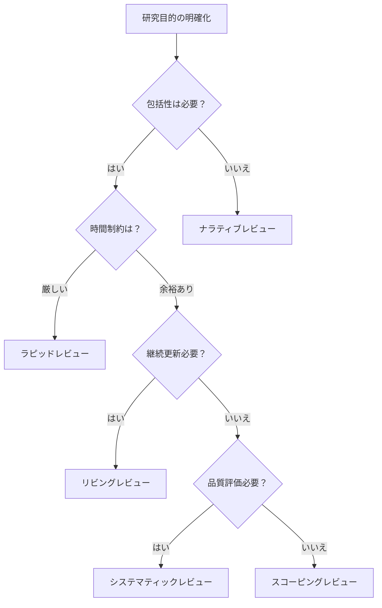

# 文献レビュースキルモジュール

## 概要
このモジュールは、2024-2025年の最新の文献レビューに関する実践的スキルを提供します。システマティックレビュー、スコーピングレビュー、AI支援ツールの活用、効率的な検索戦略、品質評価方法を含む包括的なアプローチを採用しています。

## 文献レビューのタイプと選択

### 1. レビュータイプの特徴と選択基準

#### システマティックレビュー
```yaml
特徴:
  目的: 特定の研究質問に対する包括的な証拠統合
  方法: 明示的で再現可能なプロトコル
  期間: 通常9-12ヶ月
  
適用場面:
  - 介入効果の評価
  - 診断精度の検証
  - リスク要因の特定
  - 政策決定の根拠
  
PRISMA 2020準拠要件:
  - 27項目チェックリスト
  - フロー図の作成
  - 事前プロトコル登録
  - バイアス評価の実施
```

#### スコーピングレビュー
```yaml
特徴:
  目的: 文献の全体像マッピングとギャップ特定
  方法: 広範な探索的アプローチ
  期間: 3-6ヶ月
  
適用場面:
  - 新興分野の概観
  - 研究ギャップの特定
  - 概念の明確化
  - 研究可能性の評価
  
JBI方法論準拠:
  - PCC framework (Population, Concept, Context)
  - 包含/除外基準の明確化
  - データチャーティング
```

#### ラピッドレビュー
```yaml
特徴:
  目的: 時間制約下での証拠統合
  方法: 合理化されたシステマティック手法
  期間: 2-8週間
  
適用場面:
  - 政策決定支援
  - 緊急課題対応
  - 予備的評価
  - リソース制約下
  
Cochrane推奨短縮法:
  - 言語制限の適用
  - グレー文献の限定
  - 単独レビュアーの活用
  - 簡略化された品質評価
```

#### リビングシステマティックレビュー
```yaml
特徴:
  目的: 継続的に更新される証拠統合
  方法: 定期的な検索と更新
  期間: 継続的
  
適用場面:
  - 急速に発展する分野
  - 臨床ガイドライン
  - 技術評価
  - 継続的モニタリング
  
技術要件:
  - 自動検索アラート
  - AI支援スクリーニング
  - バージョン管理
  - 更新履歴の透明化
```

### 2. レビュータイプ選択フローチャート



## 効果的な検索戦略の開発

### 1. データベース選択戦略

#### コアデータベースの組み合わせ
```yaml
分野別推奨組み合わせ:
  医学・健康科学:
    必須: PubMed + Embase + CENTRAL
    補完: Web of Science + Google Scholar
    特化: PsycINFO (精神医学), CINAHL (看護学)
    カバー率: ~95%
    
  社会科学:
    必須: Web of Science + Scopus
    補完: Google Scholar + JSTOR
    特化: PsycINFO, ERIC (教育), SocINDEX
    カバー率: ~90%
    
  工学・情報科学:
    必須: IEEE Xplore + ACM Digital Library
    補完: Web of Science + arXiv
    特化: Engineering Village, CiteSeerX
    カバー率: ~85%
    
  学際的研究:
    必須: Web of Science + Scopus + Google Scholar
    補完: 分野特化データベース
    カバー率: ~90%
```

#### 日本語文献の検索
```yaml
主要データベース:
  CiNii Research:
    - 統合検索プラットフォーム
    - 学術論文、図書、研究データ
    
  J-STAGE:
    - 日本の学術誌電子ジャーナル
    - 英語抄録付き論文多数
    
  医中誌Web:
    - 医学系日本語文献
    - シソーラス検索可能
    
  NDL Search:
    - 国立国会図書館統合検索
    - 博士論文、報告書含む
```

### 2. 検索式の構築と最適化

#### PICO/PCC フレームワークの活用
```yaml
PICO (定量的研究):
  P: Population (対象集団)
  I: Intervention (介入)
  C: Comparison (比較)
  O: Outcome (アウトカム)
  
  例: 
    P: (diabetes OR "diabetes mellitus")
    I: ("continuous glucose monitoring" OR CGM)
    C: ("self-monitoring" OR SMBG)
    O: ("glycemic control" OR HbA1c)

PCC (定性的研究):
  P: Population (対象集団)
  C: Concept (概念)
  C: Context (文脈)
  
  例:
    P: ("healthcare workers" OR nurses OR physicians)
    C: (burnout OR "compassion fatigue")
    C: (pandemic OR COVID-19 OR coronavirus)
```

#### 高度な検索テクニック
```yaml
Boolean演算子の効果的使用:
  AND: 概念の組み合わせ
  OR: 同義語・類義語の包含
  NOT: 不要な結果の除外（慎重に使用）
  
近接演算子:
  NEAR/n: n語以内の近接
  ADJ/n: 順序を保った近接
  SAME: 同一フィールド内
  
ワイルドカード:
  *: 複数文字 (pediatr* → pediatric, pediatrics)
  ?: 単一文字 (wom?n → woman, women)
  $: 語幹検索
  
フィールド指定:
  [Title]: タイトル検索
  [Title/Abstract]: タイトル・抄録
  [MeSH]: 医学件名標目
  [All Fields]: 全フィールド
```

### 3. AI支援検索ツールの活用

#### 2024-2025年の主要ツール
```yaml
検索支援AI:
  Elicit:
    - 自然言語での質問
    - 関連論文の自動抽出
    - 要約生成機能
    
  Semantic Scholar:
    - TLDR要約
    - 影響力のある引用の特定
    - 関連研究の推薦
    
  Research Rabbit:
    - 引用ネットワーク可視化
    - 類似論文の発見
    - 時系列での研究追跡
    
  Connected Papers:
    - 視覚的な論文マップ
    - 派生研究の特定
    - 研究系譜の理解
```

## スクリーニングと選択プロセス

### 1. 効率的なスクリーニング方法

#### 二段階スクリーニング
```yaml
第一段階（タイトル・抄録）:
  基準:
    - 明確な包含/除外基準
    - 疑わしい場合は包含
    - 迅速な判断
    
  効率化:
    - バッチ処理（50-100件単位）
    - キーボードショートカット活用
    - 定期的な休憩
    
第二段階（全文）:
  基準:
    - 詳細な適格性評価
    - 除外理由の記録
    - 品質評価の同時実施
    
  文書化:
    - PRISMA フロー図
    - 除外理由の集計
    - 意見相違の記録
```

#### AI支援スクリーニングツール
```yaml
Rayyan:
  機能:
    - AIによる関連性スコアリング
    - 5つ星評価システム
    - オフラインモード対応
    - 無料版：月3レビューまで
    
  活用法:
    - AI推奨の高スコア論文から開始
    - 学習機能で精度向上
    - チーム間の盲検化
    
Covidence:
  機能:
    - Cochrane承認ツール
    - 自動重複除去
    - コンフリクト管理
    - 品質評価テンプレート
    
  活用法:
    - プロトコル段階から設定
    - 役割ベースのアクセス管理
    - 進捗の可視化
    
ASReview:
  機能:
    - アクティブラーニング
    - オープンソース
    - 優先順位付け
    - 包含確率の推定
    
  活用法:
    - 初期の関連論文でトレーニング
    - 停止基準の設定
    - 感度分析の実施
```

### 2. レビュアー間の一致度管理

#### Cohen's Kappaの解釈
```yaml
一致度の評価:
  < 0.00: 一致なし
  0.00-0.20: わずかな一致
  0.21-0.40: 軽度の一致
  0.41-0.60: 中程度の一致
  0.61-0.80: 実質的な一致
  0.81-1.00: ほぼ完全な一致
  
目標値:
  - スクリーニング: κ > 0.60
  - データ抽出: κ > 0.80
  
改善策:
  - 基準の明確化
  - パイロットテスト
  - 定期的な協議
```

## 品質評価の実施

### 1. 研究デザイン別評価ツール

#### ランダム化比較試験（RCT）
```yaml
Cochrane RoB 2:
  評価領域:
    1. ランダム化プロセス
    2. 意図した介入からの逸脱
    3. アウトカムデータの欠損
    4. アウトカム測定
    5. 報告された結果の選択
    
  判定:
    - 低リスク
    - 懸念あり
    - 高リスク
    
  アウトカム別評価:
    - 各アウトカムで個別評価
    - 全体的なバイアス判定
```

#### 観察研究
```yaml
ROBINS-I:
  評価領域:
    1. 交絡
    2. 参加者選択
    3. 介入分類
    4. 意図した介入からの逸脱
    5. 欠損データ
    6. アウトカム測定
    7. 報告結果の選択
    
Newcastle-Ottawa Scale:
  評価項目:
    - 選択（最大4星）
    - 比較可能性（最大2星）
    - アウトカム（最大3星）
    
  質の判定:
    - 高質: 7-9星
    - 中質: 4-6星
    - 低質: 0-3星
```

#### 質的研究
```yaml
CASP Checklist:
  10の質問:
    1. 明確な研究目的
    2. 質的方法論の適切性
    3. 研究デザインの妥当性
    4. リクルート戦略
    5. データ収集方法
    6. 研究者と参加者の関係
    7. 倫理的配慮
    8. データ分析の厳密性
    9. 所見の明確な記述
    10. 研究の価値
    
JBI Critical Appraisal:
  評価基準:
    - 哲学的視点の一致
    - 方法論的一致
    - 方法の一致
    - 表現の一致
    - 研究者の影響
```

### 2. エビデンスの確実性評価

#### GRADE アプローチ
```yaml
初期評価:
  RCT: 高い確実性から開始
  観察研究: 低い確実性から開始
  
グレードダウン要因:
  1. バイアスのリスク（-1 or -2）
  2. 非一貫性（-1 or -2）
  3. 非直接性（-1 or -2）
  4. 不精確性（-1 or -2）
  5. 出版バイアス（-1 or -2）
  
グレードアップ要因:
  1. 大きな効果（+1 or +2）
  2. 用量反応勾配（+1）
  3. 残余交絡（+1）
  
最終判定:
  - 高：真の効果は推定値に近い
  - 中：真の効果は推定値に近いと思われる
  - 低：真の効果は推定値とかなり異なる可能性
  - 非常に低：推定値は非常に不確実
```

## データ抽出と統合

### 1. 構造化データ抽出

#### 抽出フォームの設計
```yaml
基本情報:
  - 著者、年、国
  - 研究デザイン
  - 資金源
  - 利益相反
  
参加者特性:
  - サンプルサイズ
  - 年齢、性別
  - 包含/除外基準
  - ベースライン特性
  
介入/曝露:
  - 詳細な記述
  - 期間、頻度
  - 比較対照
  - アドヒアランス
  
アウトカム:
  - 主要/副次
  - 測定方法
  - 測定時点
  - 効果推定値
  
品質評価:
  - 使用ツール
  - 各領域の評価
  - 全体評価
```

#### データ抽出の標準化
```yaml
ベストプラクティス:
  パイロット抽出:
    - 5-10論文で試行
    - フォームの修正
    - 定義の明確化
    
  二重抽出:
    - 独立した2名
    - 相違点の協議
    - 第3者による仲裁
    
  品質管理:
    - 定期的な確認
    - 抽出ガイド作成
    - 変更履歴記録
```

### 2. 統合方法の選択と実施

#### ナラティブ統合
```yaml
SWiM ガイドライン準拠:
  1. 研究のグループ化
     - 介入タイプ別
     - アウトカム別
     - 研究デザイン別
     
  2. 統合方法
     - テキスト記述
     - 表形式での要約
     - 効果の方向性プロット
     
  3. 結果の提示
     - パターンの特定
     - 異質性の探索
     - 確実性の評価
```

#### メタ分析
```yaml
実施条件:
  - 同質な研究質問
  - 統合可能なアウトカム
  - 十分な研究数（≥3）
  
統計手法:
  固定効果モデル:
    - 均質な研究
    - 小さな研究間変動
    
  ランダム効果モデル:
    - 異質な研究
    - 一般化可能性重視
    
異質性評価:
  - I²統計量
  - Q検定
  - τ²（研究間分散）
  
感度分析:
  - 研究除外の影響
  - モデル選択の影響
  - 外れ値の影響
```

## AI時代の文献レビュー

### 1. AI活用の倫理的配慮

#### 透明性の確保
```yaml
開示事項:
  使用したAIツール:
    - ツール名とバージョン
    - 使用目的と範囲
    - 人間による検証方法
    
  AIの役割:
    - 検索戦略の補助
    - スクリーニング支援
    - データ抽出の効率化
    - 品質チェック
    
  限界の明記:
    - AIの判断ミス可能性
    - バイアスのリスク
    - 最終判断は人間
```

### 2. 将来展望と準備

#### 新技術への対応
```yaml
emerging_technologies:
  大規模言語モデル:
    - 自然言語での検索
    - 自動要約生成
    - 多言語対応
    
  自動化ツール:
    - 継続的レビュー更新
    - リアルタイム統合
    - 予測的分析
    
必要なスキル:
  - AI リテラシー
  - 批判的評価能力
  - 適応的学習
```

## 実装チェックリスト

### プロトコル段階
- [ ] レビュータイプの決定
- [ ] PROSPERO登録（該当する場合）
- [ ] 検索戦略の開発
- [ ] 選択基準の明確化
- [ ] 品質評価ツールの選択

### 実施段階
- [ ] 包括的な文献検索
- [ ] 重複除去
- [ ] スクリーニングの実施
- [ ] 全文評価
- [ ] データ抽出
- [ ] 品質評価

### 統合・報告段階
- [ ] データ統合
- [ ] 結果の解釈
- [ ] PRISMA準拠の報告
- [ ] 限界の明記
- [ ] 実践への示唆

---
**モジュール作成日**: 2025-01-20
**カテゴリ**: skills/literature_review
**バージョン**: 1.0.0