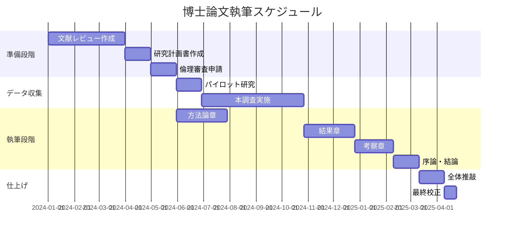

# 論文執筆タスクモジュール

## 概要
このモジュールは、2024-2025年の最新の学位論文・研究論文執筆に関する実践的タスクガイダンスを提供します。論文構造の設計、執筆プロセスの管理、デジタルツールの活用、品質向上戦略を含む包括的なアプローチを採用しています。

## 論文タイプ別の構造設計

### 1. モノグラフ形式論文

#### 基本構造と各章の役割
```yaml
標準的な章構成:
  第1章 - 序論:
    目的: 研究の背景、問題提起、研究目的の明確化
    要素:
      - 研究の動機と重要性
      - 研究質問の明確な提示
      - 論文の構成概要
      - 主要な貢献の予告
    推奨ページ数: 15-25ページ
    
  第2章 - 文献レビュー:
    目的: 既存研究の体系的整理と研究ギャップの特定
    要素:
      - 理論的背景
      - 先行研究の批判的検討
      - 研究ギャップの明確化
      - 理論的枠組みの提示
    推奨ページ数: 30-50ページ
    
  第3章 - 研究方法論:
    目的: 研究アプローチの詳細な説明と正当化
    要素:
      - 研究デザインの選択理由
      - データ収集方法
      - 分析手法
      - 倫理的配慮
      - 研究の限界
    推奨ページ数: 20-30ページ
    
  第4-6章 - 結果と分析:
    目的: 研究結果の提示と詳細な分析
    要素:
      - データの体系的提示
      - 主要な発見事項
      - パターンとテーマの分析
      - 理論との関連付け
    推奨ページ数: 60-100ページ（計）
    
  第7章 - 考察:
    目的: 結果の解釈と理論的・実践的含意
    要素:
      - 主要発見の統合
      - 理論的貢献
      - 実践的示唆
      - 研究の限界と今後の課題
    推奨ページ数: 25-35ページ
    
  第8章 - 結論:
    目的: 研究の総括と貢献の明確化
    要素:
      - 研究質問への回答
      - 主要な貢献の要約
      - 将来研究への提言
      - 最終的な考察
    推奨ページ数: 10-15ページ
```

#### 分野別のバリエーション
```yaml
人文科学型:
  特徴:
    - より長い理論的議論
    - 詳細なテキスト分析
    - 哲学的考察の重視
  追加章:
    - 理論的枠組み（独立章）
    - 歴史的文脈
    
社会科学型:
  特徴:
    - 実証と理論のバランス
    - 混合研究法の使用
    - 政策提言の包含
  追加要素:
    - パイロット研究
    - 複数の分析章
    
STEM型:
  特徴:
    - 短く簡潔な記述
    - 図表中心の結果提示
    - 技術的詳細の付録
  構成の調整:
    - 短い文献レビュー
    - 詳細な方法論
    - 複数の実験章
```

### 2. 論文ベース形式（Publication-based）

#### 構成要素と統合方法
```yaml
基本構造:
  要約章（Kappe）:
    役割: 個別論文を統合する包括的な文書
    内容:
      - 統合的序論（15-20ページ）
      - 研究の一貫性説明
      - 方法論の統合
      - 総合的考察（20-30ページ）
      - 全体的結論
    
  論文コレクション:
    要件:
      - 2-5本の査読済み論文
      - 少なくとも1本は筆頭著者
      - テーマ的一貫性
      - 出版済みまたは受理済み
    
  貢献声明:
    各論文での役割:
      - 研究デザイン
      - データ収集
      - 分析実施
      - 原稿執筆
      - 改訂作業
```

#### 論文の配置戦略
```yaml
配置オプション:
  時系列型:
    - 研究の発展を示す
    - 方法論の進化を表現
    - 学習過程の可視化
    
  テーマ型:
    - 概念的関連性で整理
    - 理論から応用へ
    - 包括的理解の構築
    
  方法論型:
    - 定性から定量へ
    - 探索から検証へ
    - 複雑性の段階的増加
```

## 執筆プロセスの管理

### 1. 執筆計画の立案

#### リバースエンジニアリング・アプローチ
```yaml
締切からの逆算:
  提出日 - 2週間: 最終校正
  提出日 - 1ヶ月: 最終稿完成
  提出日 - 2ヶ月: 全章初稿完成
  提出日 - 3ヶ月: 分析・考察執筆
  提出日 - 6ヶ月: データ収集完了
  提出日 - 9ヶ月: 方法論確定
  提出日 - 12ヶ月: 文献レビュー完成
```

#### 章別執筆スケジュール
```yaml
効率的な執筆順序:
  1. 方法論章:
     - 研究実施中に執筆
     - 詳細な記録を基に
     - 早期完成可能
     
  2. 結果章:
     - データ分析と並行
     - 図表作成を優先
     - 記述は後から
     
  3. 文献レビュー:
     - 継続的更新
     - 初期ドラフトから改訂
     - 最新文献の追加
     
  4. 序論と結論:
     - 他章完成後に執筆
     - 全体像を踏まえて
     - 一貫性の確保
```

### 2. 日々の執筆習慣

#### ポモドーロ・テクニックの応用
```yaml
論文執筆用カスタマイズ:
  朝のセッション（創造的作業）:
    - 25分: 新規執筆
    - 5分: 休憩
    - 25分: 新規執筆
    - 5分: 休憩
    - 25分: 構造見直し
    - 15分: 長休憩
    
  午後のセッション（編集作業）:
    - 25分: 文章推敲
    - 5分: 休憩
    - 25分: 引用確認
    - 5分: 休憩
    - 25分: 図表調整
    - 15分: 長休憩
    
  週間目標:
    - 月-水: 新規執筆（1500-2000語/日）
    - 木-金: 改訂と編集
    - 週末: 文献整理と計画
```

#### 執筆環境の最適化
```yaml
物理的環境:
  必須要素:
    - 静かな空間
    - 十分な照明
    - 人間工学的な椅子
    - 大型モニター（可能なら2画面）
    
デジタル環境:
  生産性ツール:
    - Focusmate（バーチャル同席）
    - Forest（集中力アプリ）
    - RescueTime（時間追跡）
    - Cold Turkey（サイトブロック）
```

### 3. 進捗管理システム

#### ガントチャート活用


#### マイルストーン設定
```yaml
主要マイルストーン:
  3ヶ月目:
    - 文献レビュー初稿完成
    - 研究方法論確定
    - □ 指導教員承認取得
    
  6ヶ月目:
    - データ収集50%完了
    - 方法論章完成
    - □ 中間発表準備
    
  9ヶ月目:
    - 全データ収集完了
    - 分析開始
    - □ 学会発表申込
    
  12ヶ月目:
    - 全章初稿完成
    - □ 内部レビュー実施
```

## デジタルツールの効果的活用

### 1. 執筆ツールの選択と設定

#### LaTeX環境の構築
```yaml
推奨セットアップ:
  エディタ:
    - Overleaf（クラウド型）
      - リアルタイム共同編集
      - バージョン履歴
      - テンプレート豊富
    - TeXstudio（ローカル）
      - 高度なカスタマイズ
      - オフライン作業
      - 統合環境
      
  パッケージ:
    必須:
      - babel（多言語）
      - graphicx（図表）
      - hyperref（ハイパーリンク）
      - biblatex（参考文献）
    推奨:
      - glossaries（用語集）
      - listings（ソースコード）
      - algorithm2e（アルゴリズム）
      
  テンプレート:
    - 大学提供テンプレート
    - thesis.cls カスタマイズ
    - 章別ファイル管理
```

#### Word環境の最適化
```yaml
効率化設定:
  スタイルの活用:
    - 見出しスタイル設定
    - 本文スタイル統一
    - 引用スタイル定義
    - 図表キャプション
    
  自動化機能:
    - 目次自動生成
    - 相互参照設定
    - 図表番号自動付与
    - 索引作成
    
  アドイン:
    - Mendeley/Zotero
    - Grammarly
    - MathType
    - Draw.io
```

### 2. バージョン管理とバックアップ

#### Git/GitHubワークフロー
```yaml
ブランチ戦略:
  main:
    - 安定版のみ
    - タグでバージョン管理
    
  develop:
    - 日々の作業
    - 定期的にmainへマージ
    
  chapter/[name]:
    - 章別ブランチ
    - 完成後develop統合
    
  revision/[date]:
    - 大規模改訂用
    - レビュー後マージ

コミット規則:
  形式: [type]: [chapter] brief description
  例:
    - feat: methodology added data analysis section
    - fix: results corrected figure 3.2
    - docs: literature updated recent studies
```

#### 自動バックアップシステム
```yaml
3-2-1ルール:
  3つのコピー:
    1. 作業用（ローカル）
    2. 同期用（クラウド）
    3. アーカイブ（外部）
    
  2つの異なるメディア:
    - クラウドストレージ
    - 物理メディア（HDD/SSD）
    
  1つのオフサイト:
    - 大学サーバー
    - または別拠点
    
自動化ツール:
  - Time Machine（Mac）
  - File History（Windows）
  - rsync（Linux）
  - Dropbox/Google Drive
```

### 3. 執筆支援AIツールの活用

#### 適切な使用場面
```yaml
推奨される使用:
  文章改善:
    - 文法チェック
    - 明確性向上
    - 言い換え提案
    例: "この文をより学術的に"
    
  構造化支援:
    - アウトライン生成
    - 段落構成提案
    - 移行文作成
    例: "この節の要点を3つに整理"
    
  アイデア展開:
    - ブレインストーミング
    - 関連概念の探索
    - 反論の想定
    例: "この理論への批判を列挙"
```

#### 倫理的使用ガイドライン
```yaml
必須開示事項:
  使用範囲:
    - どのツールを使用したか
    - どの部分で使用したか
    - どの程度依存したか
    
  開示例:
    "本論文の執筆にあたり、文法チェックと
    文章の明確性向上のためにGrammarlyおよび
    ChatGPTを使用した。すべての内容は著者が
    作成し、AIは編集支援のみに使用した。"
    
禁止事項:
  - 実質的内容の生成依頼
  - データ分析の代行
  - 理論構築の委託
  - 引用の創作
```

## 品質向上戦略

### 1. セルフレビューシステム

#### 段階的レビュープロセス
```yaml
第1段階 - 構造レビュー（1週間後）:
  チェック項目:
    □ 論理的流れの確認
    □ 各章の役割明確化
    □ 重複・欠落の確認
    □ 全体バランス評価
    
第2段階 - 内容レビュー（2週間後）:
  チェック項目:
    □ 主張の一貫性
    □ 証拠の十分性
    □ 分析の深さ
    □ 結論の妥当性
    
第3段階 - 言語レビュー（3週間後）:
  チェック項目:
    □ 文法・スペル
    □ 学術的トーン
    □ 専門用語の統一
    □ 引用形式
```

#### レビューチェックリスト
```yaml
全体構成:
  □ 研究質問は明確か
  □ 各章が研究質問に貢献しているか
  □ 議論の流れは論理的か
  □ 結論は根拠に基づいているか
  
学術的厳密性:
  □ 先行研究は網羅的か
  □ 方法論は適切か
  □ 分析は体系的か
  □ 限界は認識されているか
  
表現と形式:
  □ 文章は明確で簡潔か
  □ 専門用語は定義されているか
  □ 図表は効果的か
  □ 引用は正確か
  
独創性:
  □ 新しい知見はあるか
  □ 理論的貢献は明確か
  □ 実践的示唆は具体的か
  □ 将来研究への道筋は示されているか
```

### 2. ピアレビューの活用

#### ライティンググループの形成
```yaml
理想的な構成:
  規模: 3-5名
  頻度: 隔週開催
  時間: 2-3時間/回
  
メンバー構成:
  - 同じ段階の執筆者
  - 異なる分野の視点
  - 相互支援の精神
  
活動内容:
  1. 進捗報告（15分/人）
  2. 事前提出原稿の討議
  3. 具体的改善提案
  4. 次回までの目標設定
```

#### 効果的なフィードバック
```yaml
建設的フィードバックの原則:
  サンドイッチ法:
    1. 良い点の指摘
    2. 改善提案
    3. 励ましで締める
    
  具体性:
    × "この部分が不明確"
    ○ "p.23の第2段落で、AとBの
       関係性をより明確に説明すると
       議論が強化されると思います"
    
  実行可能性:
    - 具体的な修正案提示
    - 参考文献の推薦
    - 代替構成の提案
```

### 3. 専門家レビューの準備

#### 指導教員への提出準備
```yaml
提出パッケージ:
  必須書類:
    - 該当章の完成原稿
    - 章の要約（1-2ページ）
    - 主要な論点リスト
    - 質問事項
    
  追加資料:
    - 関連する図表
    - 参考文献リスト
    - 改訂履歴
    
  提出タイミング:
    - 章完成後1週間以内
    - 会議の1週間前
    - 定期的スケジュール
```

## 一般的な課題への対処法

### 1. ライターズブロックの克服

#### 認知的アプローチ
```yaml
ブロックのタイプ別対策:
  完璧主義型:
    - "醜い初稿"の許可
    - 制限時間での自由記述
    - 編集禁止ルール
    
  構造不明型:
    - マインドマップ作成
    - 音声録音での説明
    - 付箋での構造化
    
  動機喪失型:
    - 小さな達成目標
    - 報酬システム
    - 仲間との共有
```

#### 実践的テクニック
```yaml
即効性のある方法:
  場所の変更:
    - カフェ
    - 図書館
    - 共同作業スペース
    
  形式の変更:
    - 手書きで下書き
    - 音声入力
    - 図式化から開始
    
  時間の変更:
    - 早朝執筆
    - 短時間集中
    - ポモドーロ法
```

### 2. 時間管理の最適化

#### 優先順位マトリックス
```yaml
緊急度×重要度:
  第1象限（緊急かつ重要）:
    - 締切直前の章
    - 指導教員への提出
    - データ分析の完了
    → 即座に実行
    
  第2象限（重要だが緊急でない）:
    - 文献の継続的更新
    - 方法論の精緻化
    - 理論的枠組みの発展
    → 計画的に実行
    
  第3象限（緊急だが重要でない）:
    - 書式の細かい調整
    - 完璧な文章推敲
    - 追加的な分析
    → 委託または延期
    
  第4象限（緊急でも重要でもない）:
    - 過度な文献収集
    - 関連性の低い議論
    - 装飾的な要素
    → 削除または最小化
```

### 3. モチベーション維持

#### 長期的動機付け戦略
```yaml
内発的動機の強化:
  意味の再確認:
    - 研究の社会的意義
    - 個人的な成長
    - 知的好奇心
    
  自律性の確保:
    - 自己決定の機会
    - 方法の選択肢
    - ペースの調整
    
  達成感の創出:
    - 小目標の設定
    - 進捗の可視化
    - 成果の共有
```

#### サポートシステムの構築
```yaml
多層的支援体制:
  学術的支援:
    - 指導教員
    - 副指導教員
    - 研究仲間
    
  精神的支援:
    - 家族・友人
    - カウンセリング
    - ピアサポート
    
  実務的支援:
    - 事務スタッフ
    - 図書館員
    - ITサポート
```

## 最終段階のチェックリスト

### 提出前の総合確認
```yaml
内容面:
  □ 研究質問への明確な回答
  □ 論理的一貫性の確保
  □ 十分な証拠の提示
  □ 適切な限界の認識
  □ 明確な貢献の記述
  
形式面:
  □ 指定フォーマット準拠
  □ ページ数要件の充足
  □ 引用形式の統一
  □ 図表番号の確認
  □ 参考文献の完全性
  
技術面:
  □ スペルチェック完了
  □ 文法確認済み
  □ PDFの正常生成
  □ リンクの動作確認
  □ ファイル名の適切性
  
管理面:
  □ 必要書類の準備
  □ 提出期限の確認
  □ バックアップ作成
  □ 印刷版の準備
  □ 電子版の最適化
```

---
**モジュール作成日**: 2025-01-20
**カテゴリ**: tasks/thesis_writing
**バージョン**: 1.0.0