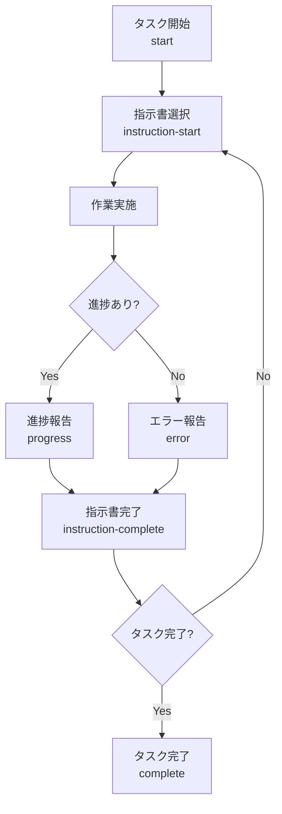

# checkpoint.sh サブコマンド体系設計

## 実装ステータス: Phase 1 完了 (2025-07-27)

### 実装済み機能
- ✅ 引数なし実行時のエラー処理
- ✅ `pending`コマンド（未完了タスク一覧）
- ✅ `summary`コマンド（タスク詳細表示）
- ✅ `start`コマンドの改善（タスクID自動生成）
- ✅ `progress`/`complete`コマンドの引数順序変更
- ✅ ワークフロー検証（エラーレベル）
- ✅ `help`コマンドの更新

### 未実装機能
- ⏳ `list`コマンド（最近のタスク一覧）
- ⏳ `restore`コマンド（最後の作業状態復元）
- ⏳ `workflow`コマンド（ワークフロー状態確認）
- ⏳ `migrate`コマンド（既存ログの移行）
- ⏳ ワークフロー状態ファイル（.json形式）

## 現状の問題
- 引数なし実行時にステータス表示のみで、AIが次のアクションを取らない
- 過去の履歴確認機能が不足
- エージェント再起動時の状態復元が困難
- 作業ワークフローの強制力がない

## 提案するサブコマンド体系

### 基本原則
1. **引数なし実行はエラー** - 明示的なサブコマンド指定を必須化
2. **機能別に整理** - タスク管理、状態確認、指示書管理を明確に分離
3. **拡張性を考慮** - 将来の機能追加を見据えた設計
4. **ワークフロー準拠** - 正しい作業手順を強制

### 標準ワークフロー



### ワークフロールール

1. **指示書使用の必須化**
   - `progress`実行前に`instruction-start`が必要
   - `instruction-complete`なしで次の指示書開始は警告

2. **進捗の整合性**
   - ステップ番号は順次増加のみ許可
   - 総ステップ数の途中変更は理由必須

3. **状態遷移の制約**
   ```
   開始 → 指示書使用中 → 進捗中 → 指示書完了 → 完了
                ↑                          ↓
                └────────────────────────┘
   ```

### サブコマンド一覧

#### タスク管理コマンド
```bash
# タスクのライフサイクル管理
start <task-id> <task-name> <total-steps>    # タスク開始
progress <current> <total> <status> <next>   # 進捗報告（要:指示書使用中）
complete <task-id> <result>                  # タスク完了
error <task-id> <error-message>              # エラー報告
```

#### 状態確認コマンド（新規）
```bash
# 現在の状態確認
current                                      # 現在の状態表示（旧：引数なし）
summary <task-id>                           # 特定タスクの詳細履歴
pending                                     # 未完了タスク一覧
list [--limit N]                           # 最近のタスク一覧（デフォルト10件）
restore                                     # 最後の作業状態を詳細表示
workflow <task-id>                          # ワークフロー状態確認（新規）
```

#### 指示書管理コマンド
```bash
# 指示書使用の追跡
instruction-start <path> [purpose] [task-id]    # 指示書使用開始
instruction-complete <path> <result> [task-id]  # 指示書使用完了
instruction-stats [--task-id ID]                # 指示書使用統計
```

#### システムコマンド
```bash
# その他
help [command]                              # ヘルプ表示
version                                     # バージョン情報
migrate                                     # 既存ログの移行（新規）
validate [--fix]                            # ワークフロー検証（新規）
```

### ワークフロー違反時の動作

#### 例1: 指示書なしで進捗報告
```bash
$ scripts/checkpoint.sh progress 2 4 "分析完了" "実装開始"
Error: ワークフロー違反 - 指示書が使用されていません

現在のタスク: TASK-ef341e
状態: タスク開始済み（指示書未使用）

必要なアクション:
1. まず指示書を選択して使用を開始してください:
   scripts/checkpoint.sh instruction-start <指示書パス> <目的>

推奨される指示書:
- instructions/ja/presets/web_api_production.md
- instructions/ja/presets/cli_tool_basic.md
```

#### 例2: 指示書完了なしで次の指示書
```bash
$ scripts/checkpoint.sh instruction-start "new_instruction.md" "新機能"
Warning: 前の指示書が未完了です

現在使用中: old_instruction.md
開始時刻: 2025-07-27 22:10:00

以下のいずれかを実行してください:
1. 現在の指示書を完了:
   scripts/checkpoint.sh instruction-complete "old_instruction.md" "成果"
2. 強制的に新しい指示書を開始（--force オプション）:
   scripts/checkpoint.sh instruction-start --force "new_instruction.md" "新機能"
```

### 状態管理

#### ディレクトリ構造
```
.checkpoint/
├── checkpoint.log          # 従来のログ（読み取り専用として保持）
├── checkpoint.v2.log       # 新形式のログ
├── workflows/              # ワークフロー状態
│   ├── TASK-ef341e.json
│   └── TASK-abc123.json
└── migration/              # 移行関連
    ├── backup/             # バックアップ
    └── migration.log       # 移行ログ
```

#### ワークフロー状態ファイル
```json
{
  "task_id": "TASK-ef341e",
  "task_name": "checkpoint.shサブコマンド体系実装",
  "current_step": 1,
  "total_steps": 4,
  "status": "in_progress",
  "workflow_state": "instruction_active",
  "active_instruction": {
    "path": "instructions/ja/system/ROOT_INSTRUCTION.md",
    "purpose": "タスク管理",
    "started_at": "2025-07-27T22:15:00Z"
  },
  "completed_instructions": [],
  "violations": [],
  "created_at": "2025-07-27T22:03:45Z",
  "updated_at": "2025-07-27T22:15:00Z"
}
```

### 移行計画

#### Phase 1: 基本実装とワークフロー
1. サブコマンド体系の実装
2. ワークフロー検証機能
3. 状態管理ファイルの導入

#### Phase 2: 移行ツール
1. `migrate`コマンドの実装
2. 既存ログの解析と変換
3. バックアップと復元機能

#### Phase 3: 完全移行
1. 旧形式のサポート終了
2. 高度な分析機能の追加

### 既存チェックポイントの移行手順

#### 1. 事前準備
```bash
# バックアップ作成
$ cp checkpoint.log checkpoint.log.backup

# 移行前の検証
$ scripts/checkpoint.sh validate
検証結果:
- タスク総数: 210
- 未完了タスク: 2
- 指示書使用記録: 10
- ワークフロー違反の可能性: 5件
```

#### 2. 自動移行
```bash
$ scripts/checkpoint.sh migrate
移行を開始します...

[1/4] バックアップ作成中...
      ✓ checkpoint.log → .checkpoint/migration/backup/checkpoint.log.20250727

[2/4] ログ解析中...
      ✓ 210タスクを検出
      ✓ 10件の指示書使用を検出

[3/4] ワークフロー状態の推定...
      ⚠ 5件のタスクでワークフロー状態が不明
      これらは「レガシー」としてマークされます

[4/4] 新形式への変換...
      ✓ .checkpoint/checkpoint.v2.log 作成
      ✓ ワークフロー状態ファイル作成

移行完了！
- 成功: 205タスク
- 警告: 5タスク（手動確認推奨）

詳細: .checkpoint/migration/migration.log
```

#### 3. 移行後の確認
```bash
$ scripts/checkpoint.sh validate
✓ すべてのタスクが正常に移行されました

$ scripts/checkpoint.sh pending
未完了タスク一覧:
1. TASK-ef341e: checkpoint.shサブコマンド体系実装
2. TASK-cmd-update: カスタムコマンド更新機能実装（レガシー）
```

#### 4. レガシータスクの処理
```bash
$ scripts/checkpoint.sh workflow TASK-cmd-update
タスク: カスタムコマンド更新機能実装
状態: レガシー（ワークフロー状態不明）

推奨アクション:
1. タスクを完了としてマーク:
   scripts/checkpoint.sh complete TASK-cmd-update "移行により完了"

2. タスクを再開:
   scripts/checkpoint.sh restore-legacy TASK-cmd-update
```

### 移行時の特別処理

1. **指示書使用記録の推定**
   - INSTRUCTION_STARTとCOMPLETEのペアリング
   - 孤立したエントリの処理

2. **ワークフロー状態の推定**
   - タスクの最終状態から逆算
   - 不明な場合は「レガシー」フラグ

3. **データ整合性の確保**
   - タスクIDの重複チェック
   - タイムスタンプの順序検証

### エラーハンドリング

```bash
# 移行中のエラー
$ scripts/checkpoint.sh migrate
Error: 移行中にエラーが発生しました

タスクID: TASK-broken
エラー: タイムスタンプの解析に失敗

対処法:
1. 手動で修正:
   vim checkpoint.log
   # 該当行を修正後、再実行

2. スキップ:
   scripts/checkpoint.sh migrate --skip-errors

3. 詳細確認:
   scripts/checkpoint.sh migrate --verbose
```

### まとめ

この設計により：
1. **ワークフロー準拠** - 正しい作業手順の強制
2. **スムーズな移行** - 既存データの保護と活用
3. **エラー耐性** - 問題のあるデータも適切に処理
4. **将来への拡張性** - 新機能追加の基盤